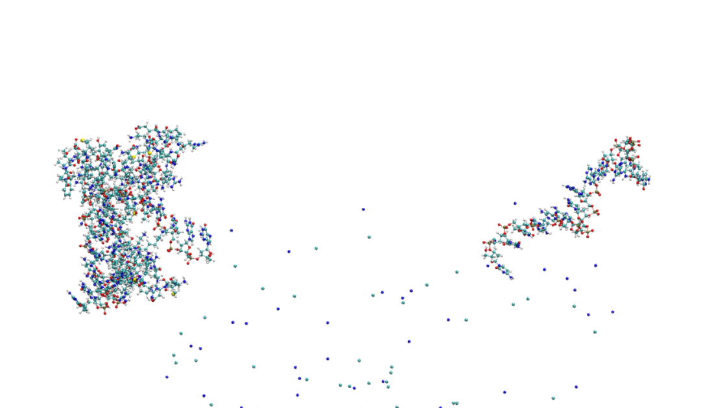

# MD_course - practical examples

The following is an overview for the practical side of the course.
You will find both information, files and instuctions here.
If you prefer to read a pdf instead of markdown, simply use 

`pandoc README.md -f markdown+smart -s -o README_pandoc_converted.pdf` 

alternatively.

`pandoc README.md -s -o README_pandoc_converted.pdf --pdf-engine=lualatex -V geometry:margin=1in -V fontsize=10pt --include-in-header=pandoc_header.tex`
if you get split over linewidths. 


## DAY 1
### Linux/Bash introduction 

When working on a cluster there may not be a GUI. Also on your own
machine it may be a lot more efficient to use a terminal.

You can do everything you can do via a GUI by typing commands. 
Here we will do so using `bash` the currently still most used shell.

Even better you can automate tedious and repetitive processes, which
would require a lot of time to do by hand.

Here is a quick overview over important bash commands

| Command | Description |
|---|---|
| `.` | Current directory |
| `~` | Home directory |
| `..` | Parent directory (one level up) |
| `;` | end of line replacement if you want multiple commands in 1 line | 
| `cd destination` | Change directory (e.g. `cd /path/to/dir`) - not writing a destination goes to `~` |
| `mkdir -p` | Create a directory and any necessary parent directories |
| `mv` | Move or rename files or directories (`mv source target`) |
| `cp` | Copy files or directories (`cp source target`) |
| `cat` | concatenates files (`cat file1 file2 file3`) |
| `touch`| creates an empty file (or updates times) | 
| `scp` | Secure copy files between hosts (`scp file user@host:/path`) |
| `pwd` | Print working directory |
| `sed "s\|to_substitute\|replaced_by\|g" ` | Replace all occurrences of `to_substitute` with `replaced_by` using `sed` |
| `grep string files`| searches for string in files| 
| `man command`| opens the manual page for the command - RTFM (Read the very fine manual... |
| `ssh user@machine` | connects to machine via ssh for your username "user" on the remote machine | 
| `ssh-keygen -t rsa -b 4096` | Generate an RSA public/private key pair with a 4096-bit key. Use this to enable passwordless SSH authentication: keep the private key secure (e.g. `~/.ssh/id_rsa`) and copy the public key (e.g. `~/.ssh/id_rsa.pub`) to the remote host's `~/.ssh/authorized_keys`. Optionally leave the passphrase empty for non-interactive logins. |
| `echo` | prints to stout: e.g. `echo foo bar`| 
| `chmod` | Change file permissions (mode). Examples: `chmod 755 file` or `chmod +x script.sh` |
| `chown` | Change file owner and group. Example: `chown user:group file` |
| `sbatch jobscript` | Submits a SLURM jobscript. |
| `squeue -u your_user_name --format="%14i %19P %30j %8u %2t %7M %5D %R" "$@" `| Displays your queued jobs| 

1) (Bash) Scripts are essentially nothing essentially nothing more storing commands in a text file so you can reuse them (also great to have reproducability - no arbitray behavior due to typos-). You usually start them with the so called shebang `#!/bin/bash` which tells the computer with which interpreter to execute it - here bash. `#!/bin/python3`would be a python script for example. You can of course completely forgo it and manually call the `bash`command in the shell.

2) Wildcards/placeholders `*` any chars, `?` one char.
3) Redirections `>` redirects stout to a new file.
`>>` appends to file.
`&>` redirects stout and sterr to a file.

3) With loops you can do a lot some examples

For loop over iterations:

```
for i in {1..5}; do
  echo "Iteration $i"
done
```


```
while true; do
    sleep 5
    # do something every 5 seconds, for example:
    echo "Still running - $(date)"
done
```

find all .gro files and do something with them

```
files=$(ls *gro)
for file in $files
do

#what you do actually want to do 
echo $file
done
```
4) Variable definitions are as simple as e.g. `myvariable=5`. It can be called then by its name adding a $ before. `$myvariable`.

5) Comments: \# is a comment symbol and everything behind it will not be executed.

6) Simple addition `newvalue=$(($oldvalue + $newvalue))`

7) Logic for comparison

| Operator / Command | Meaning / Example |
|---|---|
| `-gt` | Numeric greater than. Example: `[ "$a" -gt "$b" ]` |
| `-lt` | Numeric less than. Example: `[ "$a" -lt "$b" ]` |
| `-eq` | Numeric equal. Example: `[ "$a" -eq "$b" ]` |
| `-ne` | Numeric not equal. Example: `[ "$a" -ne "$b" ]` |
| `-ge` | Numeric greater than or equal. Example: `[ "$a" -ge "$b" ]` |
| `-le` | Numeric less than or equal. Example: `[ "$a" -le "$b" ]` |
| `=` | String equal (POSIX `[` ). Example: `[ "$str1" = "$str2" ]` |
| `!=` | String not equal. Example: `[ "$str1" != "$str2" ]` |
| `<` / `>` | String less/greater (lexicographic) in `[[ ]]` or use `\<'`/`\>'` in `[ ]`. Example: `[[ "$a" < "$b" ]]` |
| `-z` | String is empty. Example: `[ -z "$var" ]` |
| `-n` | String is not empty. Example: `[ -n "$var" ]` |
| `!` | Logical NOT. Example: `if ! [ -f file ]; then ...` |
| `&&` | Logical AND between commands/tests. Example: `[ "$a" -gt 0 ] && echo "pos"` |
| `\|\|` | Logical OR between commands/tests. Example: `[ -f f ] \|\| echo "missing"` |
 | `-e` | File exists (any type). Example: `[ -e path ]` |
| `-f` | Regular file exists. Example: `[ -f file ]` |
| `-d` | Directory exists. Example: `[ -d dir ]` |
| `-r` | File is readable. Example: `[ -r file ]` |
| `-w` | File is writable. Example: `[ -w file ]` |
| `-x` | File is executable. Example: `[ -x script.sh ]` |
| `-s` | File exists and has non-zero size. Example: `[ -s file ]` | 

Notes:
- Use `[ ... ]` (POSIX) or `[[ ... ]]` (bash). `[[ ]]` is more flexible (allows `==`, `<`, `>` without escaping and pattern matching).
- Always quote variables in tests (e.g. `[ "$a" = "$b" ]`) to avoid word-splitting and errors with empty values.
- Numeric comparisons require the `-` operators (`-eq`, `-gt`, …). Using `=`/`!=` compares strings, not numbers.
- For floating-point comparisons use external tools (e.g. `awk`, `bc`) because `test`/`[` only handle integers.
- Combine tests with `&&`, `||`, or use compound tests: `if [ -f a ] && [ -w a ]; then … fi`.
- Use `(( ))` for arithmetic expressions: `if (( a > b )); then … fi` (no `$` needed inside).
- Example: `if (( a > b && b >= 0 )); then echo "ok"; fi`
- Example combining file checks: `if [ -f file ] && [ -s file ]; then echo "exists and not empty"; fi`
8) permissions:
you may somethimes need to change permissions. To do this you can use chmod to change permissions for user, group and the rest. Using a common numbering scheme this means, e.g. `chmod 755` gives you all permissions, whereas everyone else may read and run it but not modify. (common for scripts)

| Permission | Number | chmod shorthand |
|---|---:|---|
| `---` (no permissions) | 0 | `---` |
| `--x` (execute only) | 1 | `--x` |
| `-w-` (write only) | 2 | `-w-` |
| `-wx` (write & execute) | 3 | `-wx` |
| `r--` (read only) | 4 | `r--` |
| `r-x` (read & execute) | 5 | `r-x` |
| `rw-` (read & write) | 6 | `rw-` |
| `rwx` (read, write & execute) | 7 | `rwx` |


## Setting up a Simulation for the combined Protein-DNA system 1J46.pdb

An MD simulation in GROMACS will always need 3 things
  1) coordinates, which tell the program where is what (usually a `.gro` file)
  2) a "topology" (yes it is defined different in Maths...). This contains the actual forcefield that tells 
  the program how which molecule interacts with all the others and with itself. This can be nicely separated out in a pure `.itp` 
  file for conciseness and to transport it over.
  Furthermore it wants to know (at the beginning) how the atomtypes are defined and how to deal with LR-interactions in the intra-molecular part.
  Also at the end you specify how many of which kind of molecules (in the order of the geometry `.gro`) is included.
  All this makes a `.top`file.

  3) Instructions what you expect the program to actually do with those things. 
  (Energy minimization/ MD run, how to deal with temparature (thermostat parameters), pressure (barostat parameters), constraints,
  how do describe LR-interactions, free energy dH/dlambda calculations,...  )

  Once you have all those, you can send the instructions to the "preprocessor" 

  ``` gmx grompp -f instuctions.mdp -p topology_file.top -c starting_coordinates.gro -o name_how_runfile_should_be_called.tpr```

  This then checks everything for correctness and yields a `.tpr`file.

  This you can then use for a simulation. To simplify the naming conventions and to prevent you from typing differnt stuff for
  energy, trajectory, log, etc. files you can use the `deffnm` option here, which uses the same name for everything and just changes the file endings.
  e.g. this starts a (verbose) run with the name chosen above. (HINT DO NOT WRITE .tpr here, that conflicts with other file endings.)

   ``` gmx mdrun -v -deffnm  name_how_runfile_should_be_called```

  The following are some common GROMACS mdrun output files

  | File ending | Description |
  |---|---|
  | `.gro` | Final finished output geometry: coordinates (and box vectors) in GROMACS `.gro` format, used as the new starting structure. |
  | `.xtc` | Compressed trajectory (coordinates only, reduced precision) for visualization and analysis; small file size. |
  | `.trr` | Full-precision trajectory containing coordinates, velocities, forces; much larger. |
  | `.edr` | Binary energy file with time series of energies and thermodynamic observables; read with `gmx energy -f `. |
  | `.log` | Text log of the mdrun run: settings, progress, performance summary, warnings and errors. |
  | `.cpt` | Checkpoint file for restarting runs: binary snapshot of simulation state (step, random seeds, integrator state); use with `-cpi` to continue. |

  
  
  ### pdb preparation

First get the `1J46.pdb` file from the protein database or our course.

You can quickly have a look both at the visual structure (using `vmd 1J46.pdb`) and the actual text file (e.g. using `more`, `less` or an editor like `vi`, `vim` or `nano`). 

Think of what protonation state do you expect at neutral conditions? (pH=7.2)  What are the amino-acid pKs Values for this? - Does this correspond to your assumptions?

You can use `https://server.poissonboltzmann.org/pdb2pqr` to get an automated generation of charge states of each individual pH for the amino acids. 
Still you have to be careful and you definitely should check its results.

First you want to split the (mixed) pdb file, which contains 2 DNA parts and a protein part.
For this you only need the respective `ATOM` parts in their individual files. 
To speed this up you can use the privided `split_pdb.py` script. This is a very simple python script that iterates over the lines and separates at the separator.
Alternatively you can of course also use a texteditor.

You should be left with 3 `.pdb` files. (Named `part_0.pdb`, `part_1.pdb`, `part_2.pdb` if you used the script to do this.) 

Next you want to obtain both a geometry and a "topology" (molecule specific forcefield with the ff-parameters of your chosen force field).

#### Force field paramterization and geometry files for the system
For this part you want to use `gmx pdb2gmx`.
This gromacs program allows you to write a topology based on a chosen forcefield and a geometry based on a provided pdb.

For this make shoure you have the `amber99bsc1`  folder in your current working director or to know the full path to where you put it.
Now make 3 preliminary topologies and geometries based on your pdb inputs.
It is recommended to use separated folders.
Usage of `gmx pdb2gmx` is

``` 
gmx pdb2gmx -f pdbfile -ff path/to/forcefield -o output_for_geometry.gro -i output_for_topology.itp
```


Therefore you can use 
```
 gmx pdb2gmx -f part_0.pdb -ff amber99bsc1 -ignh -o  helix_part/helix_pt1.gro -p helix_part/helix_topol_pt1.top -i helix_part/posre_h_pt1.itp
```
 and choose the option for the tip3p water model.

 If you need to do this multiple times you can also echo the selection of your water model. 
 e.g. assuming 1 corresponds to tip3p:

```
echo "1" | gmx pdb2gmx -f part_0.pdb -ff amber99bsc1 -ignh -o  helix_part/helix_pt1.gro -p helix_part/helix_topol_pt1.top -i helix_part/posre_h_pt1.itp
echo "1" | gmx pdb2gmx -f part_1.pdb -ff amber99bsc1 -ignh -o  helix_part/helix_pt2.gro -p helix_part/helix_topol_pt2.top -i helix_part/posre_h_pt2.itp
echo "1" | gmx pdb2gmx -f part_2_copy.pdb -ff amber99bsc1 -ignh -o protein_part/protein.gro -p protein_part/protein_topol.top -i protein_part/posre.itp
```

You see that the `.gro` files still contain the same coordinates as before. That makes it simple to recombine them into files for your simulation. 
For that just copy the coordinates to a new .gro File. If you instead use `gmx insert molecules` this will put them randomly into the box without preserving their coordinates.

For our simulation we explicitly want to preserve the helix. It would not do to have two separated strands nanometers from one another!
To make the combined `.gro` you need to also set the number (line 0) equal to the actual atom number in the file.
(It is possible to renumber the atoms starting from 1 to end with `gmx genconf`but not necessary.)

So next make a `.gro` File consisting of the whole helix (or the helix and the protein).

For the corresponding topology you also want to combine all systems into 1 file. You can use this irrespectively how many of strand1, strand2 and protein residues it contains, 
because you can just set the number at the very bottom.

To obtain this this make a new file `system.top` (or however you want to call it).
To have the ff paramters you should start with the header from `./amber99bsc1.ff/forcefield.itp`.
If you have it in a subfolder, then you should of course change the import to the corresponding subfolder of course.

First use the pdb2gmx generated topologies and run `python3 top_to_itp.py --file old.itp > new.itp`.
The corresponding `new.itp` files have been cleaned of everything that is a top but not strictly a molecule-specific `.itp`
In this file you want to import the corresponding itps generated previously. 

Now you still need to add the following, to include the water model, the ion-interactions and possible position restraints.
In the `[ system ]` section you can give your topology any name you want. It has no influence on the actual simulation.
Opposed to this the `[ molecules ]` section is extremely important. Here you write how many of which of your
molecules are within the geometry. Be careful to add the molecules in the correct order.
You can also have multiple of the same residues, but they NEED to be in the very same order as in your geometry.
e.g. For a system with SOL, PRO and UNL residues: 
```
SOl 100 
PRO 1 
SOL 150 
UNL 2 
SOL 1
```
opposed to 
```
PRO 1 
UNL2 
SOL 251
```  
The latter would expect your system to start with the PRO residue, followed by 2 UNL and 251 SOL residues. You can find
such errors later by going over the "Warnings" of `gmx grompp`, but if they get ignored you may end up destroying your system, 
because the apparent interactions are between the wrong indices of atoms.

So your system topology (e.g.`system.top`) needs to contain also the water forcefield (in our case tip3p) and the ion force field that you want to use.
Go ahead and add the following to your `.top` file (replace .itps with however you named your pure `.itp` files.)
And also adapt the number of residues and their order in the `[ molecules]` section according to the `.gro` file that you want to use.

``` 
; Include water topology
#include "./amber99bsc1.ff/tip3p.itp"

#include "YOUR RESPECTIVE NEW .itp file1"

#include "YOUR RESPECTIVE NEW .itp file2"

#include "YOUR RESPECTIVE NEW .itp file3"

#ifdef POSRES_WATER
; Position restraint for each water oxygen
[ position_restraints ]
;  i funct       fcx        fcy        fcz
   1    1       1000       1000       1000
#endif

; Include topology for ions
#include \"./amber99bsc1.ff/ions.itp\"

[ system ]
; Name
Protein and DNA strands

[ molecules ]
; Compound        #mols
DNA_chain_B         1
DNA_chain_C         1
Protein_chain_A     1 ; the order has to be the same as in the gro file!
```

Next first check your geometry visually with vmd  `vmd your_geometry.gro`. (once vmd is running type `pbc box` into the command line. This will show you the pbc-box. Is the boxsize ok? The largest distance between two interacting points needs to be less than half the box length - to avoid self-interaction. Even using cutoffs, it is really recommended to make the box more than twice as large in each direction that your largest molecule! If the box is too small you can edit it either manually or using `gmx editconf`.)

If it looks fine, you can also already use the `example.mdp` 
to initally grompp your system, even if it does not yet contain solvents, just to check whether all the steps so far seem correct. 
If you get just a warning that the atomnames differ, and it is about different naming schemes of the SAME atoms, you can ignore this by adding a `--maxwarn 1` (ignore 1 warning in grompp). 
If you get no further warnings or errors, next we will add the solvent. 
As the forcefield parameters are already speciefied in the topology, you just need to actually add the solvent molecules to the `.gro`file and add the number and order in the `[ molecules ]`section of the `.top`file. You may want to copy your `.gro` and `.top` files for this. 


You can now use `gmx solvate` to add water to the system. Because tip3p is a three-point model, you do not need to change the settings from the default (`spc216.gro`), but you should specify your geometry file and your topology file to modify.

It should look like this:


```
gmx solvate -cp full_system.gro -o solvated_full_system.gro -p  full_system.top 
```
HINT: ALL GMX commands have their own manual page: e.g. https://manual.gromacs.org/current/onlinehelp/gmx-solvate.html (online)
or in the command line via the `man` command. You can (and should!) always check the options  for all commands that you are using.

Now look at your system again using vmd. 


#### Interlude some quick overview over VMD (VISUAL MOLECULAR DYNAMICS)

 VMD is a molecular visualization program for displaying, animating, and analyzing large biomolecular systems using 3-D graphics and built-in scripting. VMD supports computers running MacOS X, Unix, or Windows, is distributed free of charge, and includes source code. (https://www.ks.uiuc.edu/Research/vmd/)

 While this is an extremely powerful program that can also be directly be used as a frontend for another MD software, we will only be using it for 
 visualization purposes in this course.

 The program can be opened either by itself `vmd`, which requires you to load data manually via the GUI, or you can also directly load data upon program call
 `vmd grofile.gro` - When you later read trajectories, you will see that `vmd grofile.gro trajectoryfile.xtc` is required, because the pure trajectory file only contains information about coordinates, but not atomtypes, residues etc.

 Upon opening your solvated system you should see something like this:

The Main window is the actually controlling window.
The Graphical Representation controls how stuff is represented (it can also be closed and reopened from the Main without any issues.)


Unless other settings have been saved to the `.vmdrc` file, the default will be to show everything (connected by lines).
If you need to load data into your molecules you could do so via the "Main" window (you will need that later.)
As an example you will now see how to select residues/molecules - for now select only the `resname DA DC DG DT` which should correspond to your helix. 
Typical selections are `name` (atomic names), `resname` (residue names - e.g. amino acids, base pairs), `resid` (id of residue), `serial`(index).

Further HINTS:
    Logical operations are possible and are used by adding `or` or  `and`.
    Inverting a selection with `not` is also useful (e.g. `not resname SOL`for displaying all non-water.)
    Maybe you also want to disply the environment (especially useful for H-bond selections) of a group.
    For this you can use `within X of`(e.g. `(within 5 of resname DA DG DC DT) and (resname SOL)`).
    If you do not want to cut their residues, you can also use `same resid as`.
    Using `pbc box` in the vmd console you can show the periodic box.
    If you later display a non-centered system do not use `Lines`as the Drawing Method. Instead use `DynamicBonds`.


<!--  -->

<!--  -->

As you see the display stayed the same. This is inconvenient: 
By using Display - Reset View in the Main window you can easily center on your desired fragments.


Your Drawing Method is still lines, you can change it in the Graphical Representations window. This may help for visualization purposes or also to render publication quality pictures. (We will not talk about this now. If there is time at the end of the course we can do this.).


You can also use the `Coloring Method` to e.g. manually color selections, color residues differently,...

#### Back to the system preparation

If your system looks fine, you can now go to prepare the actual simulation.

However, there remains 1 more thing to modify: So far we have a strongly charged system, in pure water.

You can count the charges by running the scripts:

`python3 scripts/count_aa_charge.py` and `python3 count_phosphate_charge.py`.

For this course we want a simulation at neutral pH. Is the current structure what you expect at neutral pH? What are the pKs values of the aminoacids/ which charges are expected on the base pairs?
Because we are dealing with purely classical force fields, the protonation states will not change!

If those charge states are correct, we now will add ions to 
1) neutralize and
2) create the ionic-concentration that we want.

For this you need a `.tpr` file (dummy- not expected for a simulation) first. 
You get this by running `gmx grompp` but you can just ignore the warning of bad charges with `-maxwarn 1`.

Then you can run `gmx genion` - please use a concentration of 150 mM. You may want to copy your original topology file because gmx genion writes
to the topology file. If you do this multiple times you will have to modify it by hand!

This could for example look like this:

```
gmx grompp -f nvt.mdp -c startgro.gro -p full_system.top -o dummy.tpr -maxwarn 1
cp full_system.top full_system_ions.top
gmx genion -s dummy.tpr  -o full_system_ions.gro -p full_system_ions.top  -neutral  yes -conc 0.050
```

Again look at the resulting `.gro` and `.top` files.
Visualize the `.gro` file with vmd. You may want to set the style to "VDW" on a selection of "not SOL" - as the ions are not bonded to anything, you will not see them well otherwise.
If everything looks fine, you can continue.
It should look similar to the following example:


#### The .mdp files

So far we have obtained 2 of the 3 required inputs. (Geometry and topology)
We still need the (`.mdp`) actual instructions what GROMACS is supposed to do with those.

For this you can use the prepared files `steep.mdp`, `nvt.mdp`, `npt_ber.mdp` and `npt.mdp`.
In principle (starting from an equilibrium configuration) only the actual instructions for the simulation in the isothermal-isobaric ensemble (`npt.mdp`) 
would be necessary. However, we do not know how good our starting guess is.
Therefore, we try to prepare our system.
1) Using an **energy-minimization** to get rid of high energy clashes, that would cause huge forces, tearing our system apart. (the corresponding .mdp can have other options, which will be ignored.)
2) Similarly running a **canonic ensamble (nVT)**  simulation should help distribute the molecules better, preventing the barostat from exploding.
3) Using the **Berendsen barostat first**, (stable, but not quite the correct ensemble) helps to get the system slowly into a region of phase-space that is already close to the npT ensemble. 
4) Using the **Parrinello-Rahman barostat** gives the correct **npT ensemble**, but may explode if the system is not yet well prepared.
(if you experience periodic fluctuations of the boxsize in your simulations in the future this may be the cause, for this check a fourier transform as a test.)


The nvT and an (maybe) an initial part of the npT simulation can be run using position restraints on the biomolecules.
`define = -DPOSRES`in the corresponding `.mdp`. **Be sure not to use them for production runs!** 


Now do an energy-minimization, and the equilibration steps and then run the simulation. 
For this (as mentioned above) first run `gmx grompp` and then `gmx mdrun`

The final production you will not do on your local machine.

For this we will now discuss how to run your systems on the cluster.

Alternatively --
For analysis you may be given a finished system.

#### Connecting to another machine via ssh

Normally you are your user at your local machine. Now you want to run this on another one.

You will connect to  int-nano.int.kit.edu using the username username by using

```
ssh -Y username@int-nano.int.kit.edu
```

There you should see your folders. Make a new folder for this course and if you need to remove/move stuff in this course consult your advisors. 
This is a group machine and we do not want you to accidentally delete data of other users.

you can then copy your inputs from the course pc via `scp` (secure copy) or `rsync`.

Those work by 
```
scp target destination
```
or 

```
rsync target destination
```

for copying whole folders it is recommendet do use  a dry-run first and then run the command again without this option if it looks correct.


```
rsync -a --progress --verbose --dry-run target destination
```


You submit scripts on a cluster using a queuing system. Here you will see a SLURM example.
We will have a special queue for this course.

**DO THIS FIRST: GENERATION OF A PUBLIC-PRIVATE KEY PAIR**
For logging in to the cluster we will use ssh with an rsa public private key pair.

For this you should first generate a keypair (feel free to also give it a different name).

```
ssh-keygen -t rsa -b 4096
```

You do not want to choose a password.


Then we will need to copy the ssh key to the foreign machine. 

Usually (if you already had an account) this would be as simple as logging in on the machine moving it to the corresponding file.
Here we will need to send this to the admin  - so copy the `.pub` key to the course folder.


Connect (via `ssh`) 
1) to the cluster (`ssh -Y username@int-nano.int.kit.edu`)
2) from the login node to the  reserved node on the cluster (`ssh user@reserved_machine`) - you can run your gmx run there. 
For this you should clarify how many resources you can use with the assistants on the day of the course.

(This will change the `mdrun options` slightly, e.g. using `-nt`, `-pin`, `-pinoffset` etc. on a CPU node or e.g. `-gpu_id`  on a GPU node.)
Before running the jobs here for the first time please get an ok of the assistants.

If you are using a GPU node please use (on the available gpu - check `nvidia-smi -l` to see what is available) to get good performance.

```
gmx mdrun -deffnm YOURFILENAME -gpu_id 0 -nt 8
```

This command you will not run from the command line. Instead
you will put your commands at the end of a SLURM job script (check the example from the course and modify it to your needs).

### A SLURM job script

```
#!/bin/sh
#SBATCH -J gromacs_run
#SBATCH --time=02:00:00                  #Set walltime
#SBATCH --nodes=1                        #Choose number of nodes  - should be 1 in all your cases
#SBATCH --ntasks=8
#SBATCH --gres=gpu:1
#SBATCH --cpus-per-task=1
#SBATCH --threads-per-core=1
#SBATCH --mem-per-cpu=500
#SBATCH --partition=gpu                     #MODIFY THIS FOR THE COURSE QUEUE
#SBATCH --mail-type=END                     # Send email at job completion
#SBATCH --mail-user=yourmail@example.edu    # Email address for notifications
#SBATCH --output=CURRENT_PATH/%j_out.log # Will save the stdout - modify this to your directory or leave out this line
#SBATCH --error=CURRENT_PATH/%j_err.log  # Will save the stderr - modify this to your directory or leave out this line


echo "Start Job $SLURM_ARRAY_TASK_ID on $HOSTNAME"  # Display job start information

#module load orca
module load gromacs
echo "using"
which gmx


############ PUT YOUR ACTUAL COMMANDS TO EXECUTE HERE
```

You can submit your script from the folder you want to run it by `sbatch runscript.sh`
### Generating an index file 

Index files allow for a more in-depth selection for later analysis or other operations.

The simples way to generate one based on logical selections is using 
`gmx make_ndx` - this requires a `.tpr` for full functionality or a `.gro` for reduced functionality.
To also use indices that have been defined previously use the `-n` option.

```
gmx make_ndx -f tprfile -n pre_existing_index_file -o new_indexfile

```
You can also simply write the indexfiles by yourself (usually using a script for whatever you need).

The structure is for a group you want to define as "SEL" where the indices correspond to your atom indices.
```
[ SEL ]
 index1 index2 ....


[ OTHERSEL ]

indexS1 indexS2

```

We will use such a ndx file to make our visualisation of the final trajectory easier on our eyes.

### Excursion: the .mdp file - Instructions for your GROMACS run

Like with most of the gromacs human-readable files, you can write comments with a ";" here.
That also means it is simple to prepare a single `.mdp`file that contains your basic run instructions and modify it for your current runs.


Let's look at some options:
```
integrator              = md
nsteps                  = 500000
nstlist                 = 10 
nstcomm                 = 50
dt                      = 0.001
nstxtcout               = 500
nstcalcenergy           = 500
```
`integrator = md` means a Leap frog integrator is used for integrating Newton's equations of motion.
It is also specified how many steps the simulation is supposed to run (`nsteps`) and how long each timestep is (`dt` (ps)).
nstxcout means the coordinate output is written in compressed form every n steps. (if you need velocity or force use `nstvout`and `nstfout`. We do not do this by default, as this triples the storage space needed.)
`coulombtype             = PME`means we are using a parallel form of ewald summation (particle mesh ewald).
For the long-range continuation we use the analytic continuation to the energy and the pressure (`DispCorr                = EnerPres`).

Temperature gets managed with the v-rescale thermostat.
```
tcoupl                  = v-rescale 
tc-grps                 = system
tau-t                   = 1.0
ref-t                   = 300
```
and pressure can be controlled by the barostat. Apart from the number of simulation steps this is the main thing you need to change during your equilibration
runs opposed to the production run.
```

pcoupl                  = no;  Berendsen; Parrinello-Rahman
pcoupltype              = isotropic
tau-p                   = 1.0
ref-p                   = 1.0
compressibility         =    4.5e-5  

```

To speed up our calculations, we use constraints on our bonds using LINCS (do not use this for planar ring-systems without thinking).

```
constraints             = all-bonds ;h-angles
constraint-algorithm    = LINCS
lincs-order             = 4
lincs-iter              = 2
verlet-buffer-tolerance = 0.0001
```

The following describes how to deal with the real-space cutoff and declares the whole system as a single energy group (for gpu parallelism).
If you want to separate nergy groups afterwards use  `gmx mdrun -rerun`options with individual energy groups. As this runs on GPU vs CPU you will save most time this way

```
rlist =1.2
rcoulomb =1.2
rvdw                     = 1.2
vdwtype =cutoff

energygrps = System
```

Those options are only for a very basic run. 
More advanced options can (like everything) be found in the documentation. **A**lways remember **R**ead **T**he very **F**ine **M**anual (**RTFM**)


### Displaying multiple frames of the trajectory without diffusion

Select the DC basepairs and then use `gmx trjconv` with the option `-fit rot+trains` to obtain a trajectory where those groups are fitted on top of another (removing its diffusion and rotation.)
This allows you to display multiple frames with vmd (change `now` to `startframe:endframe`) for a part of the trajectory and use a slight smoothing factor in the "Trajectory" section of the Graphical Representations window of vmd. This directly shows you how flexible different parts of your molecule are (if your fitted selection is rigid - e.g. a protein backbone.)

If your selection is broken over periodic boundary conditions during the trajectory, you should first center it into the box.
This is also something that you can do with the `gmx trjconv` options. The simplest way for this is ususally `-pbc cluster` and `-center`.  


### NOTES TO Self 


For assistants (will not be available to students) - all instructions for afternoon d1 can be automatically tested by running 
`make_structure_for_gromacs.sh ` followed by `run_mds.sh`

The students get the `.py`scripts, and the initial `.pdb` file to use but not the automated setup and mdruns. (They can type it themselves.)

### full data 

todo check for correctness under is2364@int-nano:/shared/user_data/is2364/md_course_example

## Course graining (day 2) 

## Data evaluation (day 3)

### Trajectory Preprocessing: Removing Periodic Boundary Artifacts

Before performing any structural analysis, all trajectories must be cleaned to remove distortions caused by periodic boundary conditions (PBC).
If this step is skipped, the resulting RMSD/RMSF/distance plots can be wrong, because molecules may appear:

* split across the simulation box,

* jumping suddenly through the box edges,

* wrapped in different ways at different frames.

This is not real motion — it’s a visualization and coordinate-storage artifact that must be fixed.

**0. Make new topology**

Make copy of topology 
`cp full_system_ions.top full_system_ions_dry.top`
Remove water
`SOL         42219`

 **1. Remove PBC jumps (make molecules whole)**

Using `-pbc nojump`, we reconstruct molecules that were split across the periodic box during MD. However, there is no guarantee that DNA strands are not split within the box.


---

**2. Generate a new `.tpr` without water**

After removing jumps and water, the updated coordinates no longer match the original `.tpr`.
We therefore create a new `.tpr` file that corresponds exactly to, ensuring all further analysis tools use a consistent reference.

---

**3. Cluster the solute so that DNA and protein appear in one connected piece**

`-pbc cluster` ensures that all atoms belonging to the same molecule are placed in the same periodic image.
This prevents DNA or protein from appearing fragmented on opposite sides of the simulation box. 


---

**4. Center the molecule of interest in the box**

We center DNA (group 1) to eliminate global translation and keep the system visually stable.
Centering is important for meaningful RMSD and for clear visualization in VMD.

---

**5. Extract the first centered frame and generate a final `.tpr`**

We write out the first frame of the centered trajectory and rebuild a final, clean `.tpr` from it.
Using a `.tpr` instead of a `.gro` is preferred because it contains full topology and reference information needed for RMSD, RMSF, H-bond, and distance analyses.

---
Total time of performing this:  

real	7m54.079s  
user	7m44.081s  
sys	0m5.831s

all traj  
real	40m43.915s
user	37m45.028s
sys	0m26.345s


```bash
traj_list=("npt_ber_posres" "npt_ber" "npt" "nvt")

echo "=== Preprocessing trajectories (nojump → center + pbc mol, KEEPING WATER) ==="

for traj in "${traj_list[@]}"; do

    xtc="${traj}.xtc"
    tpr="${traj}.tpr"
    gro="${traj}.gro"
    echo "Processing $xtc"

    # Step 1: Remove PBC jumps 

    echo -e "17" | gmx trjconv -s "$tpr" -f "$xtc" -o "${traj}_nojump.xtc" -pbc nojump -b 0 -e 10000
    echo -e "17" |  gmx trjconv -s "$tpr" -f "$xtc" -o "${traj}_nojump.gro" -pbc nojump -b 0 -e 0
    # Step 2: New tpr
    gmx grompp -f npt.mdp -c "${traj}_nojump.gro" -o "${traj}_nojump.tpr" -p full_system_ions_dry.top -maxwarn 1
    # Step 3 and 4: Cluster the structure and put it in to the center
    echo -e "0\n0" | gmx trjconv -s "${traj}_nojump.tpr" -f "${traj}_nojump.xtc" -o "${traj}_cluster.xtc" -pbc cluster
    echo -e "1\n0" | gmx trjconv -s "${traj}_nojump.tpr" -f "${traj}_cluster.xtc" -o "${traj}_center.xtc" -center
    # Step 5: generate new gro and tpr
    echo -e "0\n0" | gmx trjconv -s "${traj}_nojump.tpr" -f "${traj}_center.xtc" -o "${traj}_center.gro" -b 0 -e 0

    gmx grompp -f npt.mdp -c "${traj}_center.gro" -o "${traj}_center.tpr" -p full_system_ions_dry.top -maxwarn 1
    echo "Clean (PBC-corrected) trajectory saved → ${traj}_nojump.xtc"
    echo "-------------------------------------------------------------"

done

echo "Preprocessing completed."

```

---

### RMSD Analysis of Protein–DNA System

This section describes the analysis performed using the automated RMSD script, which computes the root-mean-square deviation (RMSD) for multiple structural groups across different simulation phases:

- `nvt.xtc` — NVT equilibration with **position restraints**
- `npt_ber_posres.xtc` — Berendsen barostat with **position restraints**
- `npt_ber.xtc` — Berendsen barostat, restraints removed
- `npt.xtc` — **Production** run using Parrinello–Rahman barostat (fully flexible)

For each trajectory, RMSD is calculated for the following groups:

- **1 – DNA**
- **4 – Protein**
- **6 – C-alpha atoms**
- **7 – Protein backbone**

Output files follow the format:

`rmsd_<trajectory>_g<group>.xvg`

Example:

rmsd_npt_gDNA.xvg → Backbone RMSD during production
rmsd_nvt_gProtein.xvg → DNA RMSD during NVT posres equilibration

#### What RMSD Measures

RMSD quantifies how much a structure deviates from the reference frame (the first frame in the trajectory
or the supplied `.tpr` file). RMSD helps evaluate:

- structural stability  
- equilibration quality  
- Protein conformational drift or unfolding  
- DNA bending  
- protein–DNA interaction stability


Demostration of different rmsd for different flexibilty. [RapidRMSD, INRIA Nanod Team. Accessed on 05.12.2025]

---

#### **RMSD of the Protein Backbone**

**Purpose:** Evaluate the global structural stability of the protein fold.

**Expected behavior:**
For a typical folded protein bound to DNA, backbone RMSD should rise slightly during equilibration and then stabilize in a compact range. Values around **0.2–0.4 nm (2–4 Å)** are characteristic of a well-behaved and structurally stable protein in MD simulations. Larger RMSD values may occur if the protein undergoes domain rearrangements or significant adaptation to DNA.

**Interpretation:**

* A stable plateau indicates proper equilibration and preservation of the folded state.
* A slow drift may signal unfolding or the protein reshaping itself around the DNA interface.
* Occasional spikes are normal and usually correspond to fluctuations in flexible loops rather than global instability.

---

### **RMSD of Protein Side Chains**

**Purpose:** Assess the mobility and rearrangement of protein side chains, especially those interacting with DNA.

**Expected behavior:**
Side-chain RMSD is normally higher than backbone RMSD because rotamers can change freely during simulation. After equilibration, typical values lie in the range **0.3–0.6 nm (3–6 Å)**, reflecting natural flexibility, interfacial breathing, and transient formation/breaking of contacts with DNA.

**Interpretation:**

* Moderate fluctuations indicate healthy side-chain motion.
* Increased RMSD near the binding interface may reflect formation or adjustment of hydrogen bonds or electrostatic contacts with DNA.
* A consistent upward trend could imply significant rearrangement of the binding pocket.
* Comparing side-chain RMSD with backbone RMSD helps distinguish **local flexibility** from **global structural changes**.

---

### **RMSD of DNA**

**Purpose:** 
RMSD of DNA characterizes global helical stability and local breathing motions during equilibration and production. Under physiological conditions, stable duplex DNA typically shows RMSD values in the range **0.15–0.30 nm (1.5–3 Å)** once equilibrated.

**Expected behavior:**

* DNA RMSD should rise during early relaxation and then form a stable plateau during production.
* Small fluctuations are normal and reflect base-pair breathing, minor-groove width changes, and backbone flexibility.

**Interpretation:**

* Terminal nucleotides often deviate the most due to end fraying or increased flexibility.
* Protein binding may introduce mild bending, groove compression, or asymmetric deformation that appears as RMSD variations.
* Strand asymmetry in RMSD can indicate differential groove tightening or sequence-dependent flexibility.

---

#### Comparing RMSD Across Trajectories

| Trajectory | What You Should Expect |
|-----------|-------------------------|
| **npt_ber_posres.xtc** | Very low RMSD due to position restraints (reference relaxation only). |
| **nvt.xtc** | Still restrained → RMSD low. |
| **npt_ber.xtc** | Restraints removed → RMSD increases as molecules relax naturally. |
| **npt.xtc** (production) | Fully physical ensemble → RMSD stabilizes, representing true dynamics. |

This progression is essential to confirm that the system is well-prepared for production MD.


This script automatically computes RMSD for four different simulation phases and four structural groups.
For each trajectory, it feeds the appropriate group numbers to `gmx rms` and generates RMSD curves without requiring any manual input.

Total time of performing this:  

real	0m7.475s  
user	0m6.788s  
sys	0m0.154s  


```
#!/bin/bash

# Preprocessed trajectories (from preprocess.sh)
traj_list=("npt_ber_posres" "npt_ber" "npt" "nvt")

# Groups for RMSD
groups=("DNA" "Backbone" "SideChain")

echo "=== Running RMSD analysis on centered trajectories ==="

for traj in "${traj_list[@]}"; do

    xtc="${traj}_center.xtc"
    tpr="${traj}_center.tpr"

    echo "Processing RMSD for: ${xtc}"

    for g in "${groups[@]}"; do

        out="rmsd_${traj}_g${g}.xvg"

        echo "  → RMSD group $g vs $g → $out"

        echo -e "${g}\n${g}" | gmx rms \
            -s "$tpr" \
            -f "$xtc" \
            -o "$out" \
            -tu ns

    done

    echo "Finished $traj"
    echo "--------------------------------------------------------"

done

echo "All RMSD analyses completed!"
```

For plotting you can use plot_xvg.py

```
usage: plot_xvg.py [-h] -i INPUT

Plot XVG files as JPEG

arguments:
  -h, --help            show this help message and exit
  -i INPUT, --input INPUT
                        Input XVG glob pattern, e.g. 'rmsd*.xvg'
```

or 
```
sage: plot_multi_xvg.py [-h] -i INPUT [-o OUTPUT] [--stride STRIDE]

Fast multi-XVG plotter with subtitle legend labels.

optional arguments:
  -h, --help            show this help message and exit
  -i INPUT, --input INPUT
                        Input glob pattern, e.g. 'rmsd_*g1.xvg'
  -o OUTPUT, --output OUTPUT
                        Output image file name (default: plot.png)
  --stride STRIDE       Downsample by keeping every Nth point (default: 1)

```

---

#### Questions for Students

##### Protein Stability
1. At what simulation step does the protein backbone reach a stable RMSD?
2. Is the protein more stable in restrained or unrestrained phases?

##### DNA Stability
3. Does DNA RMSD stabilize during production?
4. Are there signs of bending or terminal fraying?

##### Comparative Interpretation
5. Why is RMSD in `npt_ber_posres.xtc` and `nvt.xtc` artificially low but not zero?
6. What structural adjustments happen when restraints are removed (`npt_ber.xtc`)?
7. Does the production (`npt.xtc`) RMSD suggest a well-equilibrated system?

##### Physical Meaning
8. Could fluctuations reflect biological function?  
    (e.g., binding-site breathing, DNA groove changes)


---

Here is a **clean, polished Markdown section** describing **RMSF analysis of protein and DNA**, written in the same style as your RMSD explanation sections.
This text is suitable for your tutorial and assumes students will compute RMSF values themselves later (so no spoilers).

---

# ### **RMSF Analysis (Per-Residue Flexibility)**

Root-mean-square fluctuation (RMSF) measures how much each residue deviates from its **average position** during the simulation.
Unlike RMSD (a global metric), RMSF provides **local information** about which parts of the protein or DNA are flexible, rigid, or dynamically active.

RMSF was computed with:

```bash
echo -e "Protein" | gmx rmsf -s npt_center.tpr -f npt_center.xtc -o rmsf_protein.xvg -res
echo -e "DNA"     | gmx rmsf -s npt_center.tpr -f npt_center.xtc -o rmsf_DNA.xvg -res
```

The resulting `.xvg` files were visualized as bar plots, showing residue number vs. fluctuation amplitude.

```bash
optional arguments:
  -h, --help            show this help message and exit
  -i INPUT, --input INPUT
                        Input XVG glob pattern, e.g. 'rmsf*.xvg'
```
---

### **Protein RMSF**

### **Purpose**

Identify flexible loops, structured helices or strands, and dynamic interfacial residues involved in DNA binding.

### **Expected behavior**

* Well-folded secondary structure elements (α-helices, β-strands) typically show **low RMSF** (~0.05–0.15 nm).
* Loops, termini, and disordered segments show **higher RMSF** (~0.15–0.35 nm).
* DNA-binding residues may show **intermediate RMSF**, reflecting side-chain adjustment and contact reshaping.

### **Interpretation**

* Peaks correspond to flexible regions (loops, termini, solvent-exposed residues).
* Valleys correspond to rigid structural elements (helices, sheets, binding cores).
* A localized increase may indicate a **breathing motion** at the DNA interface, rotamer switching, or H-bond formation/breaking.
* A globally low RMSF profile suggests a **stable, well-equilibrated protein**.

A typical RMSF plot therefore highlights **where the protein moves**, not just how much.

---

usage: plot_rmsf.py [-h] -i INPUT

Plot RMSF XVG files as bar plots

#### Questions for Students

1. Provide interpretation of DNA rmsf.
2. Provide interpretation of Protein rmsf.

Here is a **concise, clear, and well-structured** Markdown section for **distance analysis**, covering COM distance and minimum distance, including a note about artifacts before preprocessing.
This fits perfectly into your tutorial and matches the style of your RMSD/RMSF sections.

---

### **Distance Analysis Between Protein and DNA**

Distances provide a complementary view of protein–DNA interactions by quantifying how the two molecules move relative to each other throughout the simulation. Here we compute two metrics:

1. **Center-of-mass (COM) distance** between the protein and DNA
2. **Minimum atom–atom distance** between the two molecules

These quantities help determine whether the protein remains stably bound, slides along the DNA, or undergoes conformational rearrangements.

---

#### **1. Center-of-Mass (COM) Distance**

Computed with:

```bash

gmx distance -s npt_center.tpr -f npt_center.xtc -select 'com of group "Protein" plus com of group "DNA"' -oall com_protein_dna.xvg
```

**Purpose:**
Monitor the overall separation between protein and DNA as a function of time.

**Expected behavior:**

* A stable plateau indicates persistent binding.
* Slow drifts may correspond to sliding or gradual rearrangement at the interface.
* Short, rapid fluctuations reflect local breathing and conformational flexibility.

To highlight the importance of preprocessing, we also compute the same distance **before** PBC correction:

```bash
gmx distance -s npt.tpr -f npt.xtc -select 'com of group "Protein" plus com of group "DNA"' -oall com_protein_dna_before_proc.xvg
```

This second curve typically shows discontinuities or sudden jumps caused by periodic boundary artifacts, demonstrating why `nojump` and `cluster` and centering are essential for meaningful analysis.

---

### **2. Minimum Protein–DNA Distance**

Computed with:

```bash
echo -e "Protein\nDNA" | gmx mindist \
  -s npt_center.tpr -f npt_center.xtc \
  -group -od mindist_protein_dna.xvg
```

**Purpose:**
Identify the closest approach between any atom of the protein and any atom of the DNA.

**How to interpret:**

* Persistent small distances (~0.2–0.4 nm) indicate stable contacts.
* Occasional increases may reflect momentary loosening or repositioning.
* A large, sustained increase suggests partial unbinding or a major conformational change.

Minimum distance is highly sensitive to local geometry and often correlates with hydrogen-bond formation/breaking or interfacial rearrangements.

for plotting use `plot_xvg.py` from previous chapter.

Com distances time:

real	5m53.060s  
user	4m27.111s  
sys	0m4.323s  

mindist time:

real	4m0.891s  
user	4m0.628s  
sys	0m0.073s  

---

### **Hydrogen-Bond Analysis Between Protein and DNA**

Hydrogen bonds are among the most important stabilizing interactions in protein–DNA complexes.
They contribute to specificity, affinity, and recognition of DNA shape.
In this section, we evaluate both:

1. **How many hydrogen bonds are formed during the simulation**, and
2. **How stable these hydrogen bonds are over time** using an autocorrelation function.

Hydrogen bonds were computed using the following GROMACS command:

Time for running:

real	2m2.933s  
user	69m22.370s  
sys	0m32.987s  

```bash
echo -e "4\n1" | gmx hbond \
    -s npt_center.tpr \
    -f npt_center.xtc \
    -life hb_lifetime.xvg \
    -num hb_protein_dna.xvg
```

Where:

* **Group 4** = Protein
* **Group 1** = DNA
* `hb_protein_dna.xvg` contains the time series of the number of H-bonds
* `hb_lifetime.xvg` contains the H-bond lifetime autocorrelation

---

## **1. Number of Protein–DNA H-Bonds**

This metric shows **how many hydrogen bonds exist at each frame** of the simulation.

**What to look for:**

* A **stable plateau** indicates persistent interactions between the protein and DNA.
* Fluctuations represent natural breathing motions of the interface.
* Drops to zero would indicate temporary loss of contact (unexpected for strong binding).
* Increasing or decreasing trends may reflect slow structural adjustment.

This is one of the most direct measures of protein–DNA binding stability.

To visualize the curve, we use the Python plotting script:

`python plot_hbond_lifetime.py` and  `python plot_xvg.py`

## **2. H-Bond Lifetime Autocorrelation**

The file `hb_lifetime.xvg` contains the **autocorrelation function** of hydrogen bond lifetimes.
This tells us **how long** individual H-bonds persist before breaking.

**Interpretation guidelines:**

* A **slow decay** indicates long-lived, stable interactions.
* A **fast decay** indicates transient contacts that form and break frequently.
* Many protein–DNA interfaces contain both:

  * a few strong, persistent H-bonds, and
  * several transient ones that explore binding geometries.

Plotting the autocorrelation helps distinguish these behaviors:

```bash
python plot_hbond_analysis.py
```

The script outputs:

* `hb_lifetime_plot.png`

---

## **3. How These Results Complement RMSD and Distance Analysis**

Hydrogen-bond analysis offers a **local**, interaction-specific view of stability, complementing:

* **RMSD** → global structural stability
* **RMSF** → per-residue flexibility
* **COM distance** → overall binding distance
* **Minimum distance** → closest atomic contacts

Together, these metrics provide a complete picture of the protein–DNA interface:

| Metric       | What it reveals                  |
| ------------ | -------------------------------- |
| RMSD         | Global structural changes        |
| RMSF         | Which residues are flexible      |
| H-bonds      | Specific interaction stability   |
| COM distance | Whether the protein stays bound  |
| Mindist      | Local contact formation/breaking |

---

## **4. Expected Results in a Stable Complex**

Although students will generate their own results, typical expectations are:

* Several hydrogen bonds persist throughout the production run.
* The number of H-bonds fluctuates but remains within a stable range.
* The lifetime autocorrelation decays gradually, indicating a mix of stable and transient contacts.

This reflects the dynamic but stable nature of biomolecular recognition.


