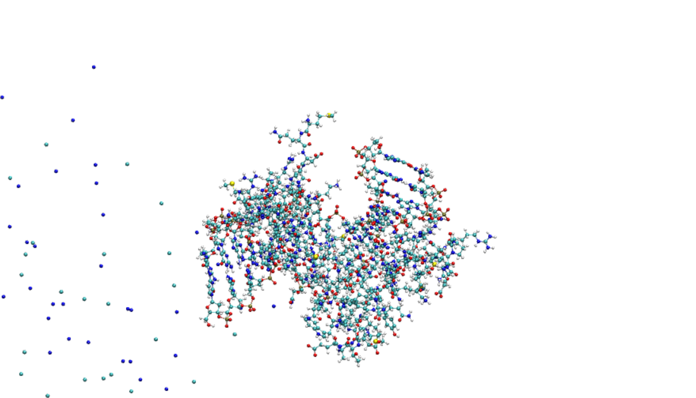

# Syngen MD course - practical examples
<a id="pdf-instructions"></a>
<details><summary>   <span role="heading" aria-level="3"><strong><big><big>Instructions to convert the README.md to PDF</big></big></strong></span>
</summary>


The following is an overview for the practical side of the course.
You will find both information, files and instructions here.
If you prefer to read a pdf instead of markdown, simply use 

`pandoc README.md -f markdown+smart -s -o README_pandoc_converted.pdf` 

The following is even better: 

```
pandoc README.md -s -o README_pandoc_converted.pdf --pdf-engine=lualatex -V geometry:margin=1in -V fontsize=10pt 
--include-in-header=pandoc_header.tex --lua-filter=details-summary-to-header.lua 
```


</details>

## DAY 1 - Bash introduction and all-atom MD

<a id="command-line-usage"></a>
<details><summary>   <span role="heading" aria-level="3"><strong><big><big>Command line (bash) usage</big></big></strong></span>
</summary>

When working on a cluster there may not be a GUI. Also on your own
machine it may be a lot more efficient to use a terminal.

You can do everything you can do via a GUI by typing commands. 
Here we will do so using `bash` the currently still most used shell.

Even better you can automate tedious and repetitive processes, which
would require a lot of time to do by hand.

Here is a quick overview over important bash commands

| Command | Description |
|---|---|
| `.` | Current directory |
| `~` | Home directory |
| `..` | Parent directory (one level up) |
| `;` | end of line replacement if you want multiple commands in 1 line | 
| `cd destination` | Change directory (e.g. `cd /path/to/dir`) - not writing a destination goes to `~` |
| `mkdir -p` | Create a directory and any necessary parent directories |
| `mv` | Move or rename files or directories (`mv source target`) |
| `cp` | Copy files or directories (`cp source target`) |
| `cat` | concatenates files (`cat file1 file2 file3`) |
| `touch`| creates an empty file (or updates times) | 
| `scp` | Secure copy files between hosts (`scp file user@host:/path`) |
| `pwd` | Print working directory |
| `sed "s\|to_substitute\|replaced_by\|g" ` | Replace all occurrences of `to_substitute` with `replaced_by` using `sed` |
| `grep string files`| searches for string in files| 
| `man command`| opens the manual page for the command - Always remember: RTFM (Read the Very Fine Manual...) |
| `ssh user@machine` | connects to machine via ssh for your username "user" on the remote machine | 
| `ssh-keygen -t ed25519 -a 1000` | Generate an Ed25519 public/private key pair (modern elliptic-curve). The -a option increases KDF rounds to harden a passphrase when encrypting the private key (effective only if you set a passphrase). |
| `ssh-keygen -t rsa -b 4096` | Generate an RSA public/private key pair with a 4096-bit key. Use this to enable passwordless SSH authentication: keep the private key secure (e.g. `~/.ssh/id_rsa`) and copy the public key (e.g. `~/.ssh/id_rsa.pub`) to the remote host's `~/.ssh/authorized_keys`. Optionally leave the passphrase empty for non-interactive logins. |
| `echo` | prints to stout: e.g. `echo foo bar`| 
| `chmod` | Change file permissions (mode). Examples: `chmod 755 file` or `chmod +x script.sh` |
| `chown` | Change file owner and group. Example: `chown user:group file` |
| `sbatch jobscript` | Submits a SLURM jobscript. |
| `squeue -u your_user_name --format="%14i %19P %30j %8u %2t %7M %5D %R" "$@" `| Displays your queued jobs| 
| `xmgrace filename1 filename2 ...` | plots xvg files |
| `xmgrace -nxy filename1 ` | plots xvg files  with mutliple y columns|
| `nano filename`| opens filename with the commandline editor nano |
| `vi filename`| opens filename with the commandline editor vi |
| `vim filename`| opens filename with the commandline editor vim |

1) (Bash) Scripts are essentially nothing essentially nothing more storing commands in a text file so you can reuse them (also great to have reproducability - no arbitray behavior due to typos-). You usually start them with the so called shebang `#!/bin/bash` which tells the computer with which interpreter to execute it - here bash. `#!/bin/python3`would be a python script for example. You can of course completely forgo it and manually call the `bash`command in the shell.

2) Wildcards/placeholders `*` any chars, `?` one char.
3) Redirections `>` redirects stout to a new file.
`>>` appends to file.
`&>` redirects stout and sterr to a file.

3) With loops you can do a lot some examples

For loop over iterations:

```
for i in {1..5}; do
  echo "Iteration $i"
done
```


```
while true; do
    sleep 5
    # do something every 5 seconds, for example:
    echo "Still running - $(date)"
done
```

find all .gro files and do something with them

```
files=$(ls *gro)
for file in $files
do

#what you do actually want to do 
echo $file
done
```
4) Variable definitions are as simple as e.g. `myvariable=5`. It can be called then by its name adding a $ before. `$myvariable`.

5) Comments: \# is a comment symbol and everything behind it will not be executed.

6) Simple addition `newvalue=$(($oldvalue + $newvalue))`

7) Logic for comparison

| Operator / Command | Meaning / Example |
|---|---|
| `-gt` | Numeric greater than. Example: `[ "$a" -gt "$b" ]` |
| `-lt` | Numeric less than. Example: `[ "$a" -lt "$b" ]` |
| `-eq` | Numeric equal. Example: `[ "$a" -eq "$b" ]` |
| `-ne` | Numeric not equal. Example: `[ "$a" -ne "$b" ]` |
| `-ge` | Numeric greater than or equal. Example: `[ "$a" -ge "$b" ]` |
| `-le` | Numeric less than or equal. Example: `[ "$a" -le "$b" ]` |
| `=` | String equal (POSIX `[` ). Example: `[ "$str1" = "$str2" ]` |
| `!=` | String not equal. Example: `[ "$str1" != "$str2" ]` |
| `<` / `>` | String less/greater (lexicographic) in `[[ ]]` or use `\<'`/`\>'` in `[ ]`. Example: `[[ "$a" < "$b" ]]` |
| `-z` | String is empty. Example: `[ -z "$var" ]` |
| `-n` | String is not empty. Example: `[ -n "$var" ]` |
| `!` | Logical NOT. Example: `if ! [ -f file ]; then ...` |
| `&&` | Logical AND between commands/tests. Example: `[ "$a" -gt 0 ] && echo "pos"` |
| `\|\|` | Logical OR between commands/tests. Example: `[ -f f ] \|\| echo "missing"` |
 | `-e` | File exists (any type). Example: `[ -e path ]` |
| `-f` | Regular file exists. Example: `[ -f file ]` |
| `-d` | Directory exists. Example: `[ -d dir ]` |
| `-r` | File is readable. Example: `[ -r file ]` |
| `-w` | File is writable. Example: `[ -w file ]` |
| `-x` | File is executable. Example: `[ -x script.sh ]` |
| `-s` | File exists and has non-zero size. Example: `[ -s file ]` | 

Notes:
- Use `[ ... ]` (POSIX) or `[[ ... ]]` (bash). `[[ ]]` is more flexible (allows `==`, `<`, `>` without escaping and pattern matching).
- Always quote variables in tests (e.g. `[ "$a" = "$b" ]`) to avoid word-splitting and errors with empty values.
- Numeric comparisons require the `-` operators (`-eq`, `-gt`, …). Using `=`/`!=` compares strings, not numbers.
- For floating-point comparisons use external tools (e.g. `awk`, `bc`) because `test`/`[` only handle integers.
- Combine tests with `&&`, `||`, or use compound tests: `if [ -f a ] && [ -w a ]; then … fi`.
- Use `(( ))` for arithmetic expressions: `if (( a > b )); then … fi` (no `$` needed inside).
- Example: `if (( a > b && b >= 0 )); then echo "ok"; fi`
- Example combining file checks: `if [ -f file ] && [ -s file ]; then echo "exists and not empty"; fi`
8) permissions:
you may sometimes need to change permissions. To do this you can use chmod to change permissions for user, group and the rest. Using a common numbering scheme this means, e.g. `chmod 755` gives you all permissions, whereas everyone else may read and run it but not modify. (common for scripts)

| Permission | Number | chmod shorthand |
|---|---:|---|
| `---` (no permissions) | 0 | `---` |
| `--x` (execute only) | 1 | `--x` |
| `-w-` (write only) | 2 | `-w-` |
| `-wx` (write & execute) | 3 | `-wx` |
| `r--` (read only) | 4 | `r--` |
| `r-x` (read & execute) | 5 | `r-x` |
| `rw-` (read & write) | 6 | `rw-` |
| `rwx` (read, write & execute) | 7 | `rwx` |

</details>


<a id="ssh"></a>
<details><summary>   <span role="heading" aria-level="3"><strong><big><big>Connecting to another machine via ssh</big></big></strong></span>
</summary>


Normally you are your user at your local machine. This will not be fast enough here in the computer room, so we will run the simulations on int-nano.
Before you can do this you need either a password setup for your user or a public-private key pair. Instructions [here](#generation-of-a-public-private-key-pair). Do this first.

You will connect to  the cluster using the username username by using

```
ssh -Y username@clusteraddress.edu
```

Make a new folder for this course and only operate within this. If you think need to remove/move stuff in this course consult your advisors. 
This is a group machine and we do not want you to accidentally delete data of other users.

You can copy your inputs from the course machine via `scp` (secure copy) or `rsync`.

Those work by 

```
scp target destination
```
or 

```
rsync target destination
```

for copying whole folders it is recommended to use a dry-run first and then run the command again without this option if it looks correct.


```
rsync -a --progress --verbose --dry-run target destination
```


You submit scripts on a cluster using a queuing system. Here you will see a SLURM example.
We will have a special queue for this course.

</details>

<a id="keypair"></a>
<details><summary>   <span role="heading" aria-level="3"><strong><big><big>Generating a public key</big></big></strong></span>
</summary>


For logging in to the cluster we will use ssh with a public private key pair.

For this you should first generate a keypair (feel free to also give it a different name).

```
ssh-keygen -t ed25519 -a 1000
```

Generates an Ed25519 SSH keypair. Ed25519 is a modern elliptic-curve signature algorithm: smaller keys, faster signing/verification, and strong security compared with RSA at similar strength. The -a 1000 flag increases the number of KDF (key‑derivation) rounds used to strengthen a passphrase when encrypting the private key, raising the computational cost for brute‑force attacks; it only has effect if you set a passphrase and uses the modern OpenSSH private‑key format. Note: options like -b are ignored for ed25519.


You do not want to choose a password.


Then we will need to copy the ssh key to the foreign machine. 

Usually (if you already had an account) this would be as simple as logging in on the machine moving it to the corresponding file.
Here this is not the case, we will need to send this to the admin  - so copy the `.pub` key to the course folder.

Once the admin has added they key you can login to the cluster: 

Connect to the cluster see section [SSH](#ssh) (`ssh -Y username@clusteraddress.edu`)

</details>


<a id="cluster-usage"></a>
<details><summary>   <span role="heading" aria-level="3"><strong><big><big>Cluster usage </big></big></strong></span>
</summary>

Then for your production runs you will need the queuing system "SLURM".

For this you should clarify how many resources and which queue you can use with the assistants on the day of the course.
A job is not run directly on the caommand line, as you will start initially on your course computers, but instead you need a jobscript, which will mean that you need
to change the `mdrun options` slightly, e.g. using `-nt`, `-pin`, `-pinoffset` etc. on a CPU node or e.g. `-gpu_id`  on a GPU node.
Before running the jobs here for the first time please consult the assistants.

If you are using an interactive job on a GPU node please use (on the available gpu - check `nvidia-smi -l` to see what is available) to get good performance.

```
gmx mdrun -deffnm YOURFILENAME -gpu_id 0 -nt 8
```

[Here](#slurm-script) you have an example of a slurm script, where you can put your commands at the end  -  modify the resource requests it to your needs.

</details>


<a id="slurm-script"></a>
<details><summary>   <span role="heading" aria-level="3"><strong><big><big>An example SLURM job script</big></big></strong></span>
</summary>

```
#!/bin/sh
#SBATCH -J gromacs_run
#SBATCH --time=02:00:00                  #Set walltime
#SBATCH --nodes=1                        #Choose number of nodes  - should be 1 in all your cases
#SBATCH --ntasks=8
#SBATCH --gres=gpu:1
#SBATCH --cpus-per-task=1
#SBATCH --threads-per-core=1
#SBATCH --mem-per-cpu=500
#SBATCH --partition=short                     #MODIFY THIS FOR THE COURSE QUEUE
#SBATCH --mail-type=END                     # Send email at job completion
#SBATCH --mail-user=yourmail@example.edu    # Email address for notifications


target_working_dir=$(pwd)
echo ${target_working_dir}
echo "Start Job $SLURM_ARRAY_TASK_ID on $HOSTNAME"  # Display job start information
echo "working on the temporary dir /scratch/$USER/$SLURM_JOB_ID" 
echo "$SCRATCH"
#module load orca
module load gromacs
echo "using"
which gmx

cd $SCRATCH

############ PUT YOUR ACTUAL COMMANDS TO EXECUTE HERE

#copy what you need back to the directory you want
rsync -a * ${target_working_dir}
```

You can submit your script from the folder you want to run it by `sbatch runscript.sh`


</details>


<a id="vmd"></a>
<details><summary>   <span role="heading" aria-level="3"><strong><big><big>Visualizing trajectories with vmd</big></big></strong></span>
</summary>

 VMD is a molecular visualization program for displaying, animating, and analyzing large biomolecular systems using 3-D graphics and built-in scripting. VMD supports computers running MacOS X, Unix, or Windows, is distributed free of charge, and includes source code. (https://www.ks.uiuc.edu/Research/vmd/)

 While this is an extremely powerful program that can also be directly be used as a frontend for another MD software, we will only be using it for 
 visualization purposes in this course.
 
Once you have a structure file `.gro` , `.xyz` you can visualize them with vmd (details will be shown when you create simulation boxes) by calling

```
vmd structurefile
```

Visualizing (binary) trajectories also requires a structurefile in addition (the pure trajectories only contain coordinates, but not atom assignments).

```
vmd structurefile trajectoryfile
```

If you save your whole trajectory information in the `.gro`format you will take-up too much space, so it is better to use the binary ones. 
</details>


<a id="gmx-commands"></a>
<details><summary>   <span role="heading" aria-level="3"><strong><big><big>Useful (gmx) GROMACS commands</big></big></strong></span>
</summary>

In the following there are some useful gmx commands - You will not need all of them during the MD-course but some of them are useful for the future.

Remember - using the manual you will get all important options for each of them.

| Command | Description |
|---|---|
| `gmx pdb2gmx` | Generate topology and processed structure files from a PDB. |
| `gmx grompp` | Preprocess inputs and assemble a runnable .tpr file. |
| `gmx mdrun` | Execute molecular dynamics or analysis using a .tpr file. |
| `gmx energy` | Extract and print energy terms from an .edr file. |
| `gmx trjconv` | Convert, center, fit, or filter trajectories and structure files. |
| `gmx solvate` | Fill a simulation box with solvent molecules. |
| `gmx insert-molecules` | Insert one or more molecules into a box at specified positions. |
| `gmx genion` | Replace solvent molecules with ions to neutralize or set ionic strength. |
| `gmx msd` | Compute mean squared displacement and diffusion coefficients. |
| `gmx angle` | Calculate time series of angles (e.g., bond/dihedral angles). |
| `gmx distance` | Measure distances between atoms or groups over a trajectory. |
| `gmx mindist` | Compute minimum distances between groups and contact counts. |
| `gmx pairdist` | Compute pairwise distances between atom/group selections. |
| `gmx rdf` | Compute radial distribution functions (pair correlation). |
| `gmx sasa` | Calculate solvent accessible surface area (per atom/group). |
| `gmx analyze` | Perform generic analysis on time series (e.g., averages, errors). |
| `gmx clustsize` | Compute cluster size distributions from clustering results. |
| `gmx density` | Compute spatial density profiles (e.g., along an axis). |
| `gmx dipoles` | Calculate dipole moments/time series for molecules/groups. |
| `gmx dump` | Dump binary GROMACS files into a readable text representation. |
| `gmx gyrate` | Compute radius of gyration over time for selections. |
| `gmx hbond` | Analyze hydrogen bonds: counts, lifetimes, geometry. |
| `gmx wham` | Perform Weighted Histogram Analysis Method for PMFs. |
| `gmx bar` | Compute free-energy differences using the Bennett Acceptance Ratio. |

</details>


<a id="simulation-setup"></a>
<details><summary>   <span role="heading" aria-level="3"><strong><big><big>MD-simulations in GROMACS  - general information</big></big></strong></span>
</summary>

An MD simulation in GROMACS will always need 3 things
  1) coordinates, which tell the program where is what (usually a `.gro` file)
  2) a "topology" (yes it is defined different in Maths...). This contains the actual forcefield that tells 
  the program how which molecule interacts with all the others and with itself. This can be nicely separated out in a pure `.itp` 
  file for conciseness and to transport it over.
  Furthermore it wants to know (at the beginning) how the atomtypes are defined and how to deal with LR-interactions in the intra-molecular part.
  Also at the end you specify how many of which kind of molecules (in the order of the geometry `.gro`) is included.
  All this makes a `.top`file.

  3) Instructions what you expect the program to actually do with those things. 
  (Energy minimization/ MD run, how to deal with temperature (thermostat parameters), pressure (barostat parameters), constraints,
  how do describe LR-interactions, free energy dH/dlambda calculations,...  )

  Once you have all those, you can send the instructions to the "preprocessor" 

  ``` 
  gmx grompp -f instructions.mdp -p topology_file.top -c starting_coordinates.gro 
  -o name_how_runfile_should_be_called.tpr
  ```

  This then checks everything for correctness and yields a `.tpr`file.

  This you can then use for a simulation. To simplify the naming conventions and to prevent you from typing differnt stuff for
  energy, trajectory, log, etc. files you can use the `deffnm` option here, which uses the same name for everything and just changes the file endings.
  e.g. this starts a (verbose) run with the name chosen above. (HINT DO NOT WRITE .tpr here, that conflicts with other file endings.)

   ```
  gmx mdrun -v -deffnm  name_how_runfile_should_be_called
  ```

  The following are some common GROMACS mdrun output files

  | File ending | Description |
  |---|---|
  | `.gro` | Final finished output geometry: coordinates (and box vectors) in GROMACS `.gro` format, used as the new starting structure. |
  | `.xtc` | Compressed trajectory (coordinates only, reduced precision) for visualization and analysis; small file size. |
  | `.trr` | Full-precision trajectory containing coordinates, velocities, forces; much larger. |
  | `.edr` | Binary energy file with time series of energies and thermodynamic observables; read with `gmx energy -f `. |
  | `.log` | Text log of the mdrun run: settings, progress, performance summary, warnings and errors. |
  | `.cpt` | Checkpoint file for restarting runs: binary snapshot of simulation state (step, random seeds, integrator state); use with `-cpi` to continue. |
</details>
  <a id="pdb-prep"></a>
<details><summary>   <span role="heading" aria-level="3"><strong><big><big>Separation of the individual molecules from the shared .pdb</big></big></strong></span>
</summary>
  


First get the `1J46.pdb` file from the protein database or the git repo of our course.

You can quickly have a look both at the visual structure (using `vmd 1J46.pdb`) and the actual text file (e.g. using `more`, `less` or an editor like `vi`, `vim` or `nano`). 

Think of what protonation state do you expect at neutral conditions? (pH=7.2)  

What are the amino-acid pKs Values for this? - Does this correspond to your assumptions?

You can use `https://server.poissonboltzmann.org/pdb2pqr` to get an automated generation of charge states of each individual pH for the amino acids. 
Still you have to be careful and you definitely should check its results.

First you want to split the (mixed) pdb file, which contains 2 DNA parts and a protein part.
For this you only need the respective `ATOM` parts in their individual files. 
To speed this up you can use the privided `AAMD_d1/sctips/split_pdb.py` script (change the filepath if necessary). This is a very simple python script that iterates over the lines and separates at the separator.
Alternatively you can of course also use a texteditor.

You should be left with 3 `.pdb` files. (Named `part_0.pdb`, `part_1.pdb`, `part_2.pdb` if you used the script to do this.) 

Next you want to obtain both a geometry and a "topology" (molecule specific forcefield with the ff-parameters of your chosen force field).
</details>


<a id="ff-geo"></a>
<details><summary>   <span role="heading" aria-levefl="3"><strong><big><big>Force field parameterization and geometry files for the system</big></big></strong></span>
</summary>


For this part you want to use `gmx pdb2gmx`.
This gromacs program allows you to write a topology based on a chosen forcefield and a geometry based on a provided pdb.

For this make shoure you have the `amber99bsc1`  folder in your current working director or to know the full path to where you put it.
Now make 3 preliminary topologies and geometries based on your pdb inputs.
It is recommended to use separated folders.
Usage of `gmx pdb2gmx` is

``` 
gmx pdb2gmx -f pdbfile -ff path/to/forcefield -o output_for_geometry.gro 
-i output_for_topology.itp
```


Therefore you can use 

```
 gmx pdb2gmx -f part_0.pdb -ff amber99bsc1 -ignh -o  helix_part/helix_pt1.gro 
 -p helix_part/helix_topol_pt1.top -i helix_part/posre_h_pt1.itp
```
 and choose the option for the tip3p water model.

 If you need to do this multiple times you can also echo the selection of your water model. 
 e.g. assuming 1 corresponds to tip3p:

```
echo "1" | gmx pdb2gmx -f part_0.pdb -ff amber99bsc1 -ignh -o  helix_part/helix_pt1.gro -p helix_part/helix_topol_pt1.top -i helix_part/posre_h_pt1.itp

echo "1" | gmx pdb2gmx -f part_1.pdb -ff amber99bsc1 -ignh -o  helix_part/helix_pt2.gro -p helix_part/helix_topol_pt2.top -i helix_part/posre_h_pt2.itp

echo "1" | gmx pdb2gmx -f part_2_copy.pdb -ff amber99bsc1 -ignh -o protein_part/protein.gro -p protein_part/protein_topol.top -i protein_part/posre.itp
```

You see that the `.gro` files still contain the same coordinates as before. That makes it simple to recombine them into files for your simulation. 
For that just copy the coordinates to a new .gro File. If you instead use `gmx insert molecules` this will put them randomly into the box without preserving their coordinates.

For our simulation we explicitly want to preserve the helix. It would not do to have two separated strands nanometers from one another!
To make the combined `.gro` you need to also set the number (line 0) equal to the actual atom number in the file.
(It is possible to renumber the atoms starting from 1 to end with `gmx genconf`but not necessary.)

So next make a `.gro` File consisting of the whole helix (or the helix and the protein).

For the corresponding topology you also want to combine all systems into 1 file. You can use this irrespectively how many of strand1, strand2 and protein residues it contains, 
because you can just set the number at the very bottom.

To obtain this this make a new file `system.top` (or however you want to call it).
To have the ff parameters you should start with the header from `./amber99bsc1.ff/forcefield.itp`.
If you have it in a subfolder, then you should of course change the import to the corresponding subfolder of course.

First use the pdb2gmx generated topologies and run `python3 top_to_itp.py --file old.itp > new.itp`.
The corresponding `new.itp` files have been cleaned of everything that is a top but not strictly a molecule-specific `.itp`
In this file you want to import the corresponding itps generated previously. 

Now you still need to add the following, to include the water model, the ion-interactions and possible position restraints.
In the `[ system ]` section you can give your topology any name you want. It has no influence on the actual simulation.
Opposed to this the `[ molecules ]` section is extremely important. Here you write how many of which of your
molecules are within the geometry. Be careful to add the molecules in the correct order.
You can also have multiple of the same residues, but they NEED to be in the very same order as in your geometry.
e.g. For a system with SOL, PRO and UNL residues: 

```
SOl 100 
PRO 1 
SOL 150 
UNL 2 
SOL 1
```

opposed to 

```
PRO 1 
UNL2 
SOL 251
```  

The latter would expect your system to start with the PRO residue, followed by 2 UNL and 251 SOL residues. You can find
such errors later by going over the "Warnings" of `gmx grompp`, but if they get ignored you may end up destroying your system, 
because the apparent interactions are between the wrong indices of atoms.

So your system topology (e.g.`system.top`) needs to contain also the water forcefield (in our case tip3p) and the ion force field that you want to use.
Go ahead and add the following to your `.top` file (replace .itps with however you named your pure `.itp` files.)
And also adapt the number of residues and their order in the `[ molecules]` section according to the `.gro` file that you want to use.

``` 
; Include water topology
#include "./amber99bsc1.ff/tip3p.itp"

#include "YOUR RESPECTIVE NEW .itp file1"

#include "YOUR RESPECTIVE NEW .itp file2"

#include "YOUR RESPECTIVE NEW .itp file3"

#ifdef POSRES_WATER
; Position restraint for each water oxygen
[ position_restraints ]
;  i funct       fcx        fcy        fcz
   1    1       1000       1000       1000
#endif

; Include topology for ions
#include \"./amber99bsc1.ff/ions.itp\"

[ system ]
; Name
Protein and DNA strands

[ molecules ]
; Compound        #mols
DNA_chain_B         1
DNA_chain_C         1
Protein_chain_A     1 ; the order has to be the same as in the gro file!
```

Next first check your geometry visually with vmd  `vmd your_geometry.gro`. (once vmd is running type `pbc box` into the command line. This will show you the pbc-box. 

Is the boxsize ok? The largest distance between two interacting points needs to be less than half the box length - to avoid self-interaction. Even using cutoffs, it is really recommended to make the box more than twice as large in each direction that your largest molecule! If the box is too small you can edit it either manually or using `gmx editconf`.)

If it looks fine, you can also already use the `example.mdp` 
to initally grompp your system, even if it does not yet contain solvents, just to check whether all the steps so far seem correct. 
If you get just a warning that the atomnames differ, and it is about different naming schemes of the SAME atoms, you can ignore this by adding a `--maxwarn 1` (ignore 1 warning in grompp). 
If you get no further warnings or errors, next we will add the solvent. 
As the forcefield parameters are already speciefied in the topology, you just need to actually add the solvent molecules to the `.gro`file and add the number and order in the `[ molecules ]` section of the `.top`file. You may want to copy your `.gro` and `.top` files for this. 


You can now use `gmx solvate` to add water to the system. Because tip3p is a three-point model, you do not need to change the settings from the default (`spc216.gro`), but you should specify your geometry file and your topology file to modify.

It should look like this:


```
gmx solvate -cp full_system.gro -o solvated_full_system.gro -p  full_system.top 
```
HINT: ALL GMX commands have their own manual page: e.g. https://manual.gromacs.org/current/onlinehelp/gmx-solvate.html (online)
or in the command line via the `man` command. You can (and should!) always check the options  for all commands that you are using.

Now look at your system again using vmd. 

</details>


<a id="vmd"></a>
<details><summary>   <span role="heading" aria-level="3"><strong><big><big>VMD overview</big></big></strong></span>
</summary>

 VMD is a molecular visualization program for displaying, animating, and analyzing large biomolecular systems using 3-D graphics and built-in scripting. VMD supports computers running MacOS X, Unix, or Windows, is distributed free of charge, and includes source code. (https://www.ks.uiuc.edu/Research/vmd/)

 While this is an extremely powerful program that can also be directly be used as a frontend for another MD software, we will only be using it for 
 visualization purposes in this course.

 The program can be opened either by itself `vmd`, which requires you to load data manually via the GUI, or you can also directly load data upon program call
 `vmd grofile.gro` - When you later read trajectories, you will see that `vmd grofile.gro trajectoryfile.xtc` is required, because the pure trajectory file only contains information about coordinates, but not atomtypes, residues etc.

 Upon opening your solvated system you should see something like this:

The Main window is the actually controlling window.
The Graphical Representation controls how stuff is represented (it can also be closed and reopened from the Main without any issues.)


Unless other settings have been saved to the `.vmdrc` file, the default will be to show everything (connected by lines).
If you need to load data into your molecules you could do so via the "Main" window (you will need that later.)
As an example you will now see how to select residues/molecules - for now select only the `resname DA DC DG DT` which should correspond to your helix. 
Typical selections are `name` (atomic names), `resname` (residue names - e.g. amino acids, base pairs), `resid` (id of residue), `serial`(index).

Further HINTS:
    Logical operations are possible and are used by adding `or` or  `and`.
    Inverting a selection with `not` is also useful (e.g. `not resname SOL`for displaying all non-water.)
    Maybe you also want to disply the environment (especially useful for H-bond selections) of a group.
    For this you can use `within X of`(e.g. `(within 5 of resname DA DG DC DT) and (resname SOL)`).
    If you do not want to cut their residues, you can also use `same resid as`.
    Using `pbc box` in the vmd console you can show the periodic box.
    If you later display a non-centered system do not use `Lines`as the Drawing Method. Instead use `DynamicBonds`.


As you see the display stayed the same. - This is inconvenient: 

By using "Display - Reset View" in the Main window you can easily center on your desired fragments.


Your Drawing Method is still lines, you can change it in the Graphical Representations window. This may help for visualization purposes or also to render publication quality pictures. (We will not talk about this now. If there is time at the end of the course we can do this.).


You can also use the `Coloring Method` to e.g. manually color selections, color residues differently,...
</details>


<a id="system-prep-p2"></a>
<details><summary>   <span role="heading" aria-level="3"><strong><big><big>Inserting ions: Neutralizing and setting ion concentrations</big></big></strong></span>
</summary>

If your system looks fine, you can now go to prepare the actual simulation.

However, there remains 1 more thing to modify: So far we have a strongly charged system, in pure water.

You can count the charges by running the scripts:

`python3 scripts/count_aa_charge.py` and `python3 count_phosphate_charge.py`.

For this course we want a simulation at neutral pH. Is the current structure what you expect at neutral pH? What are the pKs values of the aminoacids/ which charges are expected on the base pairs?
Because we are dealing with purely classical force fields, the protonation states will not change!

If those charge states are correct, we now will add ions to 
1) neutralize and
2) create the ionic-concentration that we want.

For this you need a `.tpr` file (dummy- not expected for a simulation) first. 
You get this by running `gmx grompp` but you can just ignore the warning of bad charges with `-maxwarn 1`.

Then you can run `gmx genion` - please use a concentration of 150 mM. You may want to copy your original topology file because `gmx genion` writes
to the topology file. If you do this multiple times you will have to modify it by hand!

This could for example look like this:

```
gmx grompp -f nvt.mdp -c startgro.gro -p full_system.top -o dummy.tpr -maxwarn 1
cp full_system.top full_system_ions.top
gmx genion -s dummy.tpr  -o full_system_ions.gro -p full_system_ions.top  -neutral  yes -conc 0.150
```

Again look at the resulting `.gro` and `.top` files.
Visualize the `.gro` file with vmd. You may want to set the style to "VDW" on a selection of "not SOL" - as the ions are not bonded to anything, you will not see them well otherwise.
If everything looks fine, you can continue.
It should look similar to the following example:


</details>


<a id="equilibr-and-run"></a>
<details><summary>   <span role="heading" aria-level="3"><strong><big><big>Defining instructions for the MD-program</big></big></strong></span>
</summary>
So far we have obtained 2 of the 3 required inputs. (Geometry and topology)
We still need the [`.mdp`](#mdp) instructions what the GROMACS simulation package is supposed to do with those (sometimes called **run-control files**).


For this you can use the prepared files `steep.mdp`, `nvt.mdp`, `npt_ber.mdp` and `npt.mdp`, which you can find in `AAMD_d1/example_mdp_files/`.
Depending on whether you specify instructions that differ for certain residues you also need to create [index-files](#index-files) already at this point.


In principle (starting from an equilibrium configuration) only the actual instructions for the simulation in the isothermal-isobaric ensemble (`npt.mdp`) 
would be necessary. However, we do not know how good our starting guess is. - Especially in the context of biological systems, always expect to do at least 
the following system preparation:

1) Using an **energy-minimization** to get rid of high energy clashes, that would cause huge forces, tearing our system apart. (the corresponding .mdp can have other options, which will be ignored.)
2) Similarly running a **canonic ensamble (nVT)**  simulation should help distribute the molecules better, preventing the barostat from exploding.
3) Using the **Berendsen barostat first**, (stable, but not quite the correct ensemble) helps to get the system slowly into a region of phase-space that is already close to the npT ensemble. 
4) Using the **Parrinello-Rahman barostat** gives the correct **npT ensemble**, but may explode if the system is not yet well prepared.
(if you experience periodic fluctuations of the boxsize in your simulations in the future this may be the cause, for this check a fourier transform as a test.)


The nvT and an (maybe) an initial part of the npT simulation can be run using position restraints on the biomolecules.
`define = -DPOSRES`in the corresponding `.mdp`. **Be sure not to use them for production runs!** 


Now do an energy-minimization, and the equilibration steps and then run the simulation. 
For this (as mentioned above) first run `gmx grompp` and then `gmx mdrun`

The final production you will not do on your local machine.

For this we will now discuss how to run your systems on the cluster.

For analysis you may be given a finished system if it takes too long to run production runs within this course.


</details>


<a id="index-files"></a>
<details><summary>   <span role="heading" aria-level="3"><strong><big><big>Generating an index file </big></big></strong></span>
</summary>

Index files allow for a more in-depth selection for later analysis or other operations.

The simples way to generate one based on logical selections is using 
`gmx make_ndx` - this requires a `.tpr` for full functionality or a `.gro` for reduced functionality.
To also use indices that have been defined previously use the `-n` option.

```
gmx make_ndx -f tprfile -n pre_existing_index_file -o new_indexfile

```
You can also simply write the indexfiles by yourself (usually using a script for whatever you need).

The structure is for a group you want to define as "SEL" where the indices correspond to your atom indices.
```
[ SEL ]
 index1 index2 ....


[ OTHERSEL ]

indexS1 indexS2

```

We will use such a ndx file to make our visualisation of the final trajectory easier on our eyes.
</details>


<a id="mdp"></a>
<details><summary>   <span role="heading" aria-level="3"><strong><big><big>The .mdp files</big></big></strong></span>
</summary>
Like with most of the gromacs human-readable files, you can write comments with a ";" here.
That also means it is simple to prepare a single `.mdp`file that contains your basic run instructions and modify it for your current runs.


Let's look at some options:
```
integrator              = md
nsteps                  = 500000
nstlist                 = 10 
nstcomm                 = 50
dt                      = 0.001
nstxtcout               = 500
nstcalcenergy           = 500
```
`integrator = md` means a Leap frog integrator is used for integrating Newton's equations of motion.
It is also specified how many steps the simulation is supposed to run (`nsteps`) and how long each timestep is (`dt` (ps)).
nstxcout means the coordinate output is written in compressed form every n steps. (if you need velocity or force use `nstvout`and `nstfout`. We do not do this by default, as this triples the storage space needed.)
`coulombtype             = PME`means we are using a parallel form of ewald summation (particle mesh ewald).
For the long-range continuation we use the analytic continuation to the energy and the pressure (`DispCorr                = EnerPres`).

Temperature gets managed with the v-rescale thermostat.
```
tcoupl                  = v-rescale 
tc-grps                 = system
tau-t                   = 1.0
ref-t                   = 300
```
and pressure can be controlled by the barostat. Apart from the number of simulation steps this is the main thing you need to change during your equilibration
runs opposed to the production run.
```

pcoupl                  = no;  Berendsen; Parrinello-Rahman
pcoupltype              = isotropic
tau-p                   = 1.0
ref-p                   = 1.0
compressibility         =    4.5e-5  

```

To speed up our calculations, we use constraints on our bonds using LINCS (do not use this for planar ring-systems without thinking).

```
constraints             = all-bonds ;h-angles
constraint-algorithm    = LINCS
lincs-order             = 4
lincs-iter              = 2
verlet-buffer-tolerance = 0.0001
```

The following describes how to deal with the real-space cutoff and declares the whole system as a single energy group (for gpu parallelism).
If you want to separate nergy groups afterwards use  `gmx mdrun -rerun`options with individual energy groups. As this runs on GPU vs CPU you will save most time this way

```
rlist =1.2
rcoulomb =1.2
rvdw                     = 1.2
vdwtype =cutoff

energygrps = System
```

Those options are only for a very basic run. 
More advanced options can (like everything) be found in the documentation. **A**lways remember **R**ead **T**he very **F**ine **M**anual (**RTFM**)

</details>


<a id="vmd-multiple-display"></a>
<details><summary>   <span role="heading" aria-level="3"><strong><big><big>Displaying multiple frames of the trajectory without COM diffusion</big></big></strong></span>
</summary>

Select the DC basepairs and then use `gmx trjconv` with the option `-fit rot+trains` to obtain a trajectory where those groups are fitted on top of another (removing its diffusion and rotation.)
This allows you to display multiple frames with vmd (change `now` to `startframe:endframe`) for a part of the trajectory and use a slight smoothing factor in the "Trajectory" section of the Graphical Representations window of vmd. This directly shows you how flexible different parts of your molecule are (if your fitted selection is rigid - e.g. a protein backbone.)

If your selection is broken over periodic boundary conditions during the trajectory, you should first center it into the box.
This is also something that you can do with the `gmx trjconv` options. The simplest way for this is ususally `-pbc cluster` and `-center`.  
</details>


## DAY 2 - Coarse graining of protein-dna complex 
<!-- 
<details> <summary> Tutorials on coarse-grained (CG) modelling of biomolecular system using SIRAH CG force fields </summary> -->

<a id="crystal"></a>
<details><summary>   <span role="heading" aria-level="3"><strong><big><big>Initial crystal structure of protein-DNA complex</big></big></strong></span>
</summary>


Initial crystal structure of the complex deposited in RCSB PDB data bank (PDB ID:1J46). We will simulate this complex with two different coarse-grained (CG) force fields (ff): SIRAH (Southamerican Initiative for a Rapid and Accurate Hamiltonian) and Martini.

The webpage for SIRAH: [Sirah Force Field Website](https://www.sirahff.com/)

The webpage for Martini: [Martini Force Field Website](https://cgmartini.nl/)


</details>


<a id="preliminary"></a>
<details><summary>   <span role="heading" aria-level="3"><strong><big><big>Preliminary steps: For SIRAH</big></big></strong></span>
</summary>
You will find the required `sirah_x2.2_20-07.ff` under  
`CGMD_d2/with_SIRAH/input_structure/`

Notes: 
1) Files `residuetypes.dat` and `specbond.dat` are essential for the correct definition of molecular
groups and auto-detection of disulfide bonds and cyclic DNA polymers.

2) The mapping to CG requires the correct protonation state of each residue at a given pH. We recommend using the PDB2PQR server (https://server.poissonboltzmann.org/pdb2pqr) and choosing the output naming scheme of AMBER for best compatibility.
For the course you can use the previous `pdb`-Structure from afternoon_1.

First you should either create a topology referring to your ff file (like on day 1) - alternatively you can create symbolic links to the ff folder in the following way.
```
ln -s ../sirah_x2.2_20-07.ff sirah.ff
```
This command creates a symbolic link named `sirah.ff` in the current directory that points to the directory where you put your ff folder e.g. `../sirah_x2.2_20-07.ff`. Using a symlink lets tools and scripts refer to the force-field folder by a stable name (`sirah.ff`) while keeping the actual files in a shared or versioned location. 

Notes:

- The link uses a relative path, so moving or renaming either the target directory or the folder containing the link will break it. Use `readlink -f sirah.ff` or `ls -l sirah.ff` to inspect where it points.
- To remove the link, use `rm sirah.ff` (this removes only the link, not the target files).
- Ensure the target directory contains the expected force-field files and that you have appropriate read permissions. Some GROMACS tools and scripts expect a folder with the exact name `sirah.ff`, so the symlink simplifies compatibility.

Do the same for 
```
ln -s sirah.ff/residuetypes.dat
ln -s sirah.ff/specbond.dat
```
</details>


<a id="cgrepr"></a>
<details><summary>   <span role="heading" aria-level="3"><strong><big><big>Build CG representation</big></big></strong></span>
</summary>


```
./sirah.ff/tools/CGCONV/cgconv.pl -i complex.pdb -o complex_cg.pdb
```
Now CG representation of the complex is as follows


run pdb2gmx again (e.g.)

```
gmx pdb2gmx -f complex_cg.pdb -o complex_cg.gro

```
Note: During long simulations of DNA, capping residues may eventually separate. If you want to avoid this effect, which is called helix fraying, add Watson-Crick (WC) restraints at terminal base pairs. Merging both DNA chains is convenient when planning to apply restraints between them. Use `topol_DNA2.itp` file to edit.


</details>


<a id="system-creation-cg"></a>
<details><summary>   <span role="heading" aria-level="3"><strong><big><big>Create and solvate the system </big></big></strong></span>
</summary>


Define the simulation box of the system
```
gmx editconf -f complex_cg.gro -o complex_cg_box.gro -bt octahedron -d 2.0 -c
```
Add WT4 molecules
```
gmx solvate -cp complex_cg_box.gro -cs sirah.ff/wt416.gro -o complex_cg_sol1.gro
```

Note: Edit topol.top to add number of WT4 molecules. Use grep -c WP1 1CRN_cg_sol1.gro to know number. Alternatively add the `.top` file to the options of gmx solvate - see day 1.
</details>

<a id="wt-removal-cg"></a>
<details><summary>   <span role="heading" aria-level="3"><strong><big><big>Remove WT4 molecules within 0.3 nm of protein </big></big></strong></span>
</summary>


 ```
echo q | gmx make_ndx -f complex_cg_sol1.gro -o complex_cg_sol1.ndx

gmx grompp -f sirah.ff/tutorial/3/GPU/em1_CGPROT.mdp -p topol.top -po delete1.mdp -c complex_cg_sol1.gro -o complex_cg_sol1.tpr -maxwarn 1

gmx select -f complex_cg_sol1.gro -s complex_cg_sol1.tpr -n complex_cg_sol1.ndx -on rm_close_wt4.ndx -select 'not (same residue as (resname WT4 and within 0.3 of group Protein))

gmx editconf -f complex_cg_sol1.gro -o complex_cg_sol2.gro -n rm_close_wt4.ndx
```

Note: Edit topol.top again to modify WT4 number.


</details>


<a id="counterions-cg"></a>
<details><summary>   <span role="heading" aria-level="3"><strong><big><big>Add CG counterions and 0.15M NaCl </big></big></strong></span>
</summary>

In SIRAH, the ion count for a target salt concentration is computed from

$N_0 = \frac{N_{\text{WT4}} \times C_0}{5.05}$


System charge \(Q\) is incorporated through

$N_{+} = N_0 - \frac{Q}{2}, \quad N_{-} = N_0 + \frac{Q}{2}$


Here  
- $N_{+}$ = number of cations to add  
- $N_{-}$ = number of anions to add
- $N_{WT4}$ = number of WT4 solvent bead in system
- $C_{0}$ = solvent concentration
 
After rounding, these values provide the final ion counts.
For reference: [Machado, M. R.; Pantano, S. *Split the Charge Difference in Two! A Rule of Thumb for Adding Proper Amounts of Ions in MD Simulations.* **J. Chem. Theory Comput.** **2020**, *16* (3), 1367–1372](https://pubs.acs.org/doi/10.1021/acs.jctc.9b00953)


```
gmx grompp -f sirah.ff/tutorial/3/GPU/em1_CGPROT.mdp -p topol.top -po delete2.mdp -c complex_cg_sol2.gro -o complex_cg_sol2.tpr -maxwarn 1
gmx genion -s complex_cg_sol2.tpr -o complex_cg_ion.gro -np 67 -pname NaW -nn 55 -nname ClW
```
When prompted, choose to substitute WT4 molecules by ions and edit the
[ molecules ] section in topol.top to include the CG ions and the correct number of WT4.

</details>


<a id="vis-cg"></a>
<details><summary>   <span role="heading" aria-level="3"><strong><big><big>Visualize the system </big></big></strong></span>
</summary>

```
./sirah.ff/tools/g_top2psf.pl -i topol.top -o complex_cg_ion.psf

vmd complex_cg_ion.psf complex_cg_ion.gro -e sirah.ff/tools/sirah_vmdtk.tcl
```
The structure now looks like this:


Create an index file including a group for the backbone GN and GO beads

```
echo -e "a GN GO\n\nq" | gmx make_ndx -f complex_cg_ion.gro -o complex_cg_ion.ndx
```
Generate restraint files for the backbone GN and GO beads.
```
gmx genrestr -f complex_cg.gro -n complex_cg_ion.ndx -o bkbres.itp

gmx genrestr -f complex_cg.gro -n complex_cg_ion.ndx -o bkbres_soft.itp -fc 100 100 100
```

Add the restraint topol_Protein.itp.


</details>


<a id="run-cg"></a>
<details><summary>   <span role="heading" aria-level="3"><strong><big><big>Run the simulation</big></big></strong></span>
</summary>


**Energy Minimization of side chains** by restraining the backbone*
```
gmx grompp -f em1_CGPROT.mdp -p ../topol.top -po em1.mdp -n ../complex_cg_ion.ndx -c ../complex_cg_ion.gro -r ../complex_cg_ion.gro -o complex_cg_em1.tpr
gmx mdrun -deffnm complex_cg_em1 -v 
```

**Energy Minimization** of the whole system
```
gmx grompp -f em2_CGPROT.mdp -p ../topol.top -po em2.mdp -n ../complex_cg_ion.ndx -c complex_cg_em1.gro -o complex_cg_em2.tpr
gmx mdrun -deffnm complex_cg_em2 -v 
```

Make new index group for Protein and DNA. 
```
gmx make_ndx -f ../complex_cg_ion.gro -n ../complex_cg_ion.ndx -o index.ndx
```

**Solvent equilibration**  (wall time 242 s, ntmpi 4 ntomp 4)
```
gmx grompp -f eq1_CGPROT.mdp -p ../topol.top -po eq1.mdp -n index.ndx -c complex_cg_em2.gro -r complex_cg_em2.gro -o complex_cg_eq1.tpr
gmx mdrun -deffnm complex_cg_eq1 -v 
```

**Soft equilibration to improve side chain solvation** (wall time 1203 s, ntmpi 4 ntomp 4, total 25ns run)
```
gmx grompp -f eq2_CGPROT.mdp -p ../topol.top -po eq2.mdp -n index.ndx -c complex_cg_eq1.gro -r complex_cg_eq1.gro -o complex_cg_eq2.tpr
gmx mdrun -deffnm complex_cg_eq2 -v 
```
**Production run**
```
gmx grompp -f md_CGPROT.mdp -p ../topol.top -po md.mdp -n index.ndx -c complex_cg_eq2.gro -o complex_cg_md.tpr
gmx mdrun -deffnm complex_cg_md -v (wall time 505 s, ntmpi 4 ntomp 4, total 10ns run)
```

**Visualizing the simulation**

Make sure the moleucles are not broken across pbc. It may be good to center the system and or to fit backbones on top of one another. 
```
gmx trjconv -s complex_cg_em1.tpr -f complex_cg_md.xtc -o complex_cg_md.whole.xtc -n index.ndx -pbc whole
gmx trjconv -s complex_cg_em1.tpr -f complex_cg_md.whole.xtc -o complex_cg_md.whole.nojump.xtc -n index.ndx -pbc nojump
gmx trjconv -s complex_cg_em1.tpr -f complex_cg_md.whole.nojump.xtc -o complex_cg_md.whole.nojump.mol.xtc -n index.ndx -pbc mol -center
```
Below is the CG simulation animation:


</details>
<a id="preliminary"></a>
<details><summary>   <span role="heading" aria-level="3"><strong><big><big>Preliminary steps: For Martini</big></big></strong></span>
</summary>
You will find the required files to set up the system for Martini CG simulation under  
`CGMD_d2/with_MARTINI/. We will use Martinize-python code (Works in python2) to make CG representation and initial pdb structure of the complex (complex.pdb).

At first, sse VMD to separate protein and DNA part from main pdb. Now, we have two pdbs: protein_aa.pdb & dna_aa.pdb.

</details>
<a id="cgrepr"></a>
<details><summary>   <span role="heading" aria-level="3"><strong><big><big>Build CG representation</big></big></strong></span>
</summary>
  
First build the CG DNA using the martinize-dna.py script.
```
gmx editconf -f dna_AA.pdb -o dna_aa.gro
python martinize-dna.py -dnatype ds-stiff -f dna_aa.gro -o dna.top -x dna_CG.pdb 
```
Notes:  -dnatype ds-stiff : dsDNA topology using the stiff elastic network.

You can explore more !

Next, build the CG protein using the martinize.py script
```
gmx editconf -f protein_AA.pdb -o protein_aa.gro
python2 martinize.py -f protein_aa.gro -o protein.top -x protein_CG.pdb -ss dssp_protein.ssd -p backbone -ff elnedyn22
```
Notes: Need to add secondary structure of protein from DSSP server or gmx dssp.

We will now merge the PDB files corresponding to the CG models (protein_CG.pdb and dna_CG.pdb) using the cat command for example.
```
cat dna_CG.pdb protein_CG.pdb > complex_cg.pdb
grep ATOM complex_cg.pdb > complex_CG-cleaned.pdb
```
Let's visualize the system once using VMD. 


Now we need to make combine topology file for protein and DNA. We already have dna.top file (which corresponds to DNA only). We modify this top file. At first modify the name of the file using mv command.
```
mv dna.top cg-complex.top
```


</details>
<a id="system-creation-cg"></a>
<details><summary>   <span role="heading" aria-level="3"><strong><big><big>Create and solvate the system </big></big></strong></span>
</summary>
Define the simulation box of the system and add the solvent molecules as we did earlier in SIRAH.
  
```
gmx editconf -f complex_CG-cleaned.pdb -d 1.2 -bt dodecahedron -o box.gro
gmx solvate -cp box.gro -cs water.gro -o solvated.gro -radius 0.22
```
Notes:  

1) water.gro : a pre-equilibrated box of water
2) radius 0.22 : It enforces a minimum solute–solvent separation to prevent bead overlaps that would otherwise destabilize the initial energy minimization.
3) Edit cg-complex.top to add proper number of W molecules.

Next, add CG counterions and 0.15M NaCl:

```
gmx grompp -f ions.mdp -c solvated.gro -p cg-complex.top -o ions.tpr
gmx genion -s ions.tpr -o ions.gro -p cg-complex.top -pname NA -nname CL -conc 0.15 -neutral
```
Notes: Edit cg-complex.top again to add proper number of W molecules and ION numbers.

</details>


<a id="run-cg"></a>
<details><summary>   <span role="heading" aria-level="3"><strong><big><big>Run the simulation</big></big></strong></span>
</summary>

The required files are already in CGMD_d2/with_Martini/
Energy Minimization 

```
gmx grompp -f em.mdp -c ions.gro -p cg-complex.top -o 01-em -maxwarn 1
gmx mdrun -v -deffnm 01-em
```
Next, short equilibration,

```
gmx grompp -f equil.mdp -c 01-em.gro -p cg-complex.top -o 02-eq
gmx mdrun -v -deffnm 02-eq -rdd 2.0
```

Notes: Elastic networks add spring-like bonds between distant beads. The -rdd 2.0 option enlarges the domain cells so all elastic bonds fit within the interaction range, preventing bond breakage and simulation crashes.

Finally, production run,

```
gmx grompp -f mdrun.mdp -c 02-eq.gro -p cg-complex.top -o 03-run
gmx mdrun -v -deffnm 03-run -rdd 2.0
```
After applying PBC correction to the trajectory, visualize the system.


</details>


## DAY 3 - Data evaluation 

<a id="gmx-energy"></a>
<details><summary>   <span role="heading" aria-level="3"><strong><big><big>Energy Analysis: Pressure, Density, Total Energy</big></big></strong></span>
</summary>


During equilibration, the system should reach stable thermodynamic conditions.
We extract **pressure**, **density**, and **total energy** from the `.edr` files to verify that each MD stage behaves physically and is properly equilibrated.

To extract these quantities for one simulation (e.g., `eq.edr`):

```
gmx energy -f eq.edr -o eq_total_energy.xvg
```
Then you will see interactive window where you shold choose the respective terms you are interested in. For now look at the potential, kinetic and total energy as well as the density, and pressure.

You can always use the energies and box-sizes to have an immediate check during equilibrations, whether you still need to continue or you can already assume that the system is in equilibrium.
Rememeber: You can only ever evaluate average properties in equilibrium. Otherwise ergodicity is not given and a time-average is not an ensemble-average!

Students should perform this analysis for **one trajectory**.

The resulting file will be an `.xvg` file, which is essentially in the grace file format.
You can immediately open it with 

```
xmgrace file
```

or if you chose multiple entries


```
xmgrace -nxy filename
```

which opens it for multiple y-columns.
Xmgrace is quite powerful and light-weight, which means it is also simple to run over the network. 


Alternatively, if you prefer to plot with a python script you can either write one yourself, but for convenience, a **extract_energies.sh is provided** to repeat this extraction for all `.edr` files automatically. Please adapt it if you have different file naming.

You should check if the average properties reach a constant value 

* especially the density and total energy
* do the contributions add up?
* does the temperature average reproduce the value you expect
* what about the pressure average?


Plots can be generated with the general-purpose script:

```
python3 plot_xvg.py -i '*xvg'
```

Or for better visualisaton: 

```
python3 plot_xvg.py -i '*dens*xvg' --ylim 950 1050 --ylabel "Density (kg/m^3)"
```

This gives a quick visual check that the system reached equilibrium before continuing with structural analysis.

</details>


<a id="rdf"></a>
<details><summary>   <span role="heading" aria-level="3"><strong><big><big>Radial Distribution Function (RDF): Ion–Water Structure</big></big></strong></span>
</summary>


To characterize the local solvation structure around ions, we compute the radial distribution function (RDF) between **sodium ions** and **water oxygen atoms**. For speed, we analyze only the first **1000 ps**, which is sufficient to obtain smooth statistics.

Run RDF calculation:

```
gmx rdf -s npt.tpr -f npt.xtc -o rdf_ion_water.xvg -b 0 -e 1000
```

An interactive menu will appear; select **Na** as the reference group and **Water** (or SOL) as the second group.
This produces an RDF curve showing how water is structured around ions.

Students should identify:

* the **first solvation shell** (first sharp RDF peak)
* the **second solvation shell** (next broader peak)
* the distance at which RDF approaches 1 (bulk-like behavior)

Plots can be generated using the same script:

```
python3 plot_xvg.py -i 'rdf*xvg' --xlim 0 1.25
```

</details>


<a id="pbc-removal"></a>
<details><summary>   <span role="heading" aria-level="3"><strong><big><big>Trajectory Postprocessing: Removing Periodic Boundaries</big></big></strong></span>
</summary>


Before performing any structural analysis, all trajectories must be cleaned to remove distortions caused by PBC.
If this step is skipped, the resulting RMSD/RMSF/distance plots can be wrong, because molecules may appear:

* split across the simulation box,

* jumping suddenly through the box edges,

* wrapped in different ways at different frames.


**0. Make new topology**

Make copy of topology 
`cp full_system_ions.top full_system_ions_dry.top`
Remove water
`SOL         42219`

 **1. Remove PBC jumps (make molecules whole)**

Using `-pbc nojump`, we reconstruct molecules that were split across the periodic box during MD. However, there is no guarantee that DNA strands are not split within the box.


---

**2. Generate a new `.tpr` without water**

After removing jumps and water, the updated coordinates no longer match the original `.tpr`.
We therefore create a new `.tpr` file that corresponds exactly to, ensuring all further analysis tools use a consistent reference.

---

**3. Cluster the solute so that DNA and protein appear in one connected piece**

`-pbc cluster` ensures that all atoms belonging to the same molecule are placed in the same periodic image.
This prevents DNA or protein from appearing fragmented on opposite sides of the simulation box. 


---

**4. Center the molecule of interest in the box**

We center DNA (group 1) to eliminate global translation and keep the system visually stable.
Centering is important for meaningful RMSD and for clear visualization in VMD.

---

**5. Extract the first centered frame and generate a final `.tpr`**

We write out the first frame of the centered trajectory and rebuild a final, clean `.tpr` from it.
Using a `.tpr` instead of a `.gro` is preferred because it contains full topology and reference information needed for RMSD, RMSF, H-bond, and distance analyses.

---
Total time of performing this is **~35 minutes** so it maigh be better to add -b N -e M to make it faster.


```
#!/bin/bash

# Trajectories to preprocess
traj_list=("npt") # for all files ("npt_ber_posres" "npt_ber" "npt" "nvt")

echo "=== Preprocessing trajectories (nojump → center + pbc mol, KEEPING WATER) ==="

for traj in "${traj_list[@]}"; do

    xtc="${traj}.xtc"
    tpr="${traj}.tpr"
    gro="${traj}.gro"
    echo "Processing $xtc"

    # Step 1: Remove PBC jumps (reconstruct molecules)

    echo -e "non-Water" | gmx trjconv -s "$tpr" -f "$xtc" -o "${traj}_nojump.xtc" -pbc nojump # -b 0 -e 10000 # add this to make it faster
    echo -e "non-Water" |  gmx trjconv -s "$tpr" -f "$xtc" -o "${traj}_nojump.gro" -pbc nojump -b 0 -e 0

    gmx grompp -f npt.mdp -c "${traj}_nojump.gro" -o "${traj}_nojump.tpr" -p full_system_ions_dry.top -maxwarn 1

    echo -e "System\nSystem" | gmx trjconv -s "${traj}_nojump.tpr" -f "${traj}_nojump.xtc" -o "${traj}_cluster.xtc" -pbc cluster
    echo -e "DNA\nSystem" | gmx trjconv -s "${traj}_nojump.tpr" -f "${traj}_cluster.xtc" -o "${traj}_center.xtc" -center

    echo -e "System\nSystem" | gmx trjconv -s "${traj}_nojump.tpr" -f "${traj}_center.xtc" -o "${traj}_center.gro" -b 0 -e 0

    gmx grompp -f npt.mdp -c "${traj}_center.gro" -o "${traj}_center.tpr" -p full_system_ions_dry.top -maxwarn 1
    echo "Clean (PBC-corrected) trajectory saved → ${traj}_nojump.xtc"
    echo "-------------------------------------------------------------"

done

echo "Preprocessing completed."
```

Peform it and visualize the result. Compare nojump, cluster and center structures. 

</details>


<a id="rmsd"></a>
<details><summary>   <span role="heading" aria-level="3"><strong><big><big>RMSD Analysis of Protein–DNA System</big></big></strong></span>
</summary>


RMSD quantifies how much a structure deviates from its reference conformation.
It is used to assess whether the system reaches a stable configuration and how protein and DNA adapt during simulation.

RMSD is computed for:

* **DNA (Group 1)**
* **Protein Backbone (Group 7)**
* **Protein Side Chains (Group 11 or 12)**

The automated script generates files following the pattern:

```
rmsd_<trajectory>_g<group>.xvg
```

These can be plotted with `plot_xvg.py` and `plot_multi_xvg.py`.


<strong><big> RMSD of the Protein Backbone</strong></big>


Backbone RMSD reflects the overall fold stability.

**Expected behavior:**

* RMSD increases slightly after restraints are removed and then stabilizes.
* Typical values for a folded protein bound to DNA are **0.2–0.4 nm (2–4 Å)**.

**Interpretation:**

* A stable plateau → protein maintains its fold.
* Slow drift → adaptation to DNA or unfolding.
* Spikes → flexible loops, not global instability.


<strong><big>RMDS of Protein Side Chains </strong></big>

Side-chain RMSD captures local flexibility at the DNA interface.

**Expected behavior:**

* Higher than backbone RMSD due to rotamer changes.
* Stable systems typically show **0.3–0.6 nm (3–6 Å)**.

**Interpretation:**

* Moderate fluctuations → normal breathing motion.
* Increased values → interfacial rearrangements or H-bond switching.
* Upward drift → major reorganization.


<strong><big> RMSD of DNA </strong></big>

DNA RMSD reports global helical stability.

**Expected behavior:**

* Stable duplex DNA typically ranges **0.15–0.30 nm (1.5–3 Å)**.
* Fluctuations reflect base-pair breathing and backbone motion.

**Interpretation:**

* Terminal regions often contribute disproportionately to RMSD because their motion (end fraying) shifts the overall duplex alignment.

* Protein binding may introduce mild bending or groove compression, which appears as gradual RMSD changes rather than sharp spikes.

* Asymmetric RMSD behavior between strands or between equivalent structural regions can indicate localized deformation or directional bending of the helix.


<strong><big> Example Bash Script for RMSD Calculation</strong></big>


RMSD can be computed with gmx rms command: 

```
gmx rms -s md.tpr -f md.xtc -o rmsd.xvg -tu ns
```

Do it for DNA and check the results.

Sciript for all the systems:

```
#!/bin/bash

traj_list=("npt")
groups=("DNA" "Backbone" "SideChain")

for traj in "${traj_list[@]}"; do
    xtc="${traj}_center.xtc"
    tpr="${traj}_center.tpr"

    for g in "${groups[@]}"; do
        out="rmsd_${traj}_g${g}.xvg"
        echo -e "${g}\n${g}" | gmx rms -s "$tpr" -f "$xtc" -o "$out" -tu ns
    done
done
```

Time to run: a few seconds.

Please adapt tou your file naming if it differs.


<strong><big> Plotting RMSD</strong></big>

Use:

```
python plot_xvg.py -i "rmsd*.xvg"
```

or the multi-plotter:

```
python plot_multi_xvg.py -i "rmsd_*gDNA.xvg"
```

<strong><big> Questions for Students</strong></big>

1. Do the RMSD differences indicate global conformational changes or only local fluctuations?
2. Based on RMSD patterns, would you classify your protein–DNA complex as rigid, moderately flexible, or highly dynamic?
    Justify your answer using numbers from your plots.

</details>

<a id="rmsf"></a>
<details><summary>   <span role="heading" aria-level="3"><strong><big><big>RMSF Analysis (Per-Residue Flexibility)</big></big></strong></span>
</summary>


Root-mean-square fluctuation (RMSF) measures how much each residue deviates from its **average position** during the simulation.
Unlike RMSD (a global metric), RMSF provides **local information** about which parts of the protein or DNA are flexible, rigid, or dynamically active.

RMSF can be computed with:

```
echo -e "Protein" | gmx rmsf -s npt_center.tpr -f npt_center.xtc -o rmsf_protein.xvg -res
echo -e "DNA"     | gmx rmsf -s npt_center.tpr -f npt_center.xtc -o rmsf_DNA.xvg -res
```

The resulting `.xvg` files were visualized as bar plots, showing residue number vs. fluctuation amplitude.

```
optional arguments:
  -h, --help            show this help message and exit
  -i INPUT, --input INPUT
                        Input XVG glob pattern, e.g. 'rmsf*.xvg'
```


<strong><big> Protein RMSF</big></strong>

Identify flexible loops, structured helices or strands, and dynamic interfacial residues involved in DNA binding.

<strong><big> Expected behavior</big></strong>

* Well-folded secondary structure elements (alpha-helices, beta-sheets) typically show **low RMSF** (~0.05–0.15 nm).
* Loops, termini, and disordered segments show **higher RMSF** (~0.15–0.35 nm).
* DNA-binding residues may show **intermediate RMSF**, reflecting side-chain adjustment and contact reshaping.


<strong><big> Interpretation</big></strong>

* Peaks correspond to flexible regions (loops, termini, solvent-exposed residues).
* Valleys correspond to rigid structural elements (helices, sheets, binding cores).
* A localized increase may indicate a **breathing motion** at the DNA interface, rotamer switching, or H-bond formation/breaking.
* A globally low RMSF profile suggests a **stable, well-equilibrated protein**.

A typical RMSF plot therefore highlights **where the protein moves**, not just how much.


Plot RMSF XVG files as bar plots

```
plot_rmsf.py -i INPUT
```


<strong><big> Questions for Students</big></strong>

1. Provide interpretation of DNA rmsf.
2. Provide interpretation of Protein rmsf.

</details>


<a id="dna-protein-dist"></a>
<details><summary>   <span role="heading" aria-level="3"><strong><big><big>Distance Analysis Between Protein and DNA</big></big></strong></span>
</summary>


Distances provide a complementary view of protein–DNA interactions by quantifying how the two molecules move relative to each other throughout the simulation. Here we compute two metrics:

1. **Center-of-mass (COM) distance** between the protein and DNA
2. **Minimum atom–atom distance** between the two molecules

These quantities help determine whether the protein remains stably bound, slides along the DNA, or undergoes conformational rearrangements.


<strong><big>1. Center-of-Mass (COM) Distance</big></strong>

Computed with:

```
gmx distance -s npt.tpr -f npt.xtc -select 'com of group "Protein" plus com of group "DNA"' -oall com_protein_dna.xvg
```

Monitor the overall separation between protein and DNA as a function of time.

**Expected behavior:**

* A stable plateau indicates persistent binding.
* Slow drifts may correspond to sliding or gradual rearrangement at the interface.
* Short, rapid fluctuations reflect local breathing and conformational flexibility.

To highlight the importance of preprocessing, we also compute the same distance **before** PBC correction:

```
gmx distance -s npt.tpr -f npt.xtc -select 'com of group "Protein" plus com of group "DNA"' -oall com_protein_dna_before_proc.xvg
```

This second curve typically shows discontinuities or sudden jumps caused by periodic boundary artifacts, demonstrating why `nojump` and `cluster` and centering are essential for meaningful analysis.


<strong><big>2. Minimum Protein–DNA Distance</big></strong>

Computed with:

```
echo -e "Protein\nDNA" | gmx mindist \
  -s npt_center.tpr -f npt_center.xtc \
  -group -od mindist_protein_dna.xvg
```

Identify the closest approach between any atom of the protein and any atom of the DNA.

**How to interpret:**

* Persistent small distances (~0.2–0.4 nm) indicate stable contacts.
* Occasional increases may reflect momentary loosening or repositioning.
* A large, sustained increase suggests partial unbinding or a major conformational change.

Minimum distance is highly sensitive to local geometry and often correlates with hydrogen-bond formation/breaking or interfacial rearrangements.

for plotting use `plot_xvg.py` from previous chapter.

Com distances time to compute **~5 minutes**

Mindist time to compute **~4 minutes**

</details>


<a id="hbond"></a>
<details><summary>   <span role="heading" aria-level="3"><strong><big><big>Hydrogen-Bond Analysis Between Protein and DNA</big></big></strong></span>
</summary>


Hydrogen bonds are among the most important stabilizing interactions in protein–DNA complexes.
They contribute to specificity, affinity, and recognition of DNA shape.
In this section, we evaluate both:

1. **How many hydrogen bonds are formed during the simulation**, and
2. **How stable these hydrogen bonds are over time** using an autocorrelation function. (This shows you whether you can trust the sampling of 1.)

Hydrogen bonds can be computed using `gmx hbond`:

```
gmx hbond -s npt_center.tpr -f npt_center.xtc -life hb_lifetime.xvg -num hb_protein_dna.xvg
```

Where:

* `hb_protein_dna.xvg` contains the time series of the number of H-bonds
* `hb_lifetime.xvg` contains the H-bond lifetime autocorrelation


<strong><big>1. Number of Protein–DNA H-Bonds</big></strong>

This metric shows **how many hydrogen bonds exist at each frame** of the simulation.

**What to look for:**

* A **stable plateau** indicates persistent interactions between the protein and DNA.
* Fluctuations represent natural breathing motions of the interface.
* Drops to zero would indicate temporary loss of contact (unexpected for strong binding).
* Increasing or decreasing trends may reflect slow structural adjustment.

This is one of the most direct measures of protein–DNA binding stability.

To visualize the curve, we use the Python plotting script:

`python plot_hbond_lifetime.py` and  `python plot_xvg.py`

<strong><big>2. H-Bond Lifetime Autocorrelation</big></strong>

The file `hb_lifetime.xvg` contains the **autocorrelation function** of hydrogen bond lifetimes.
This tells us **how long** individual H-bonds persist before breaking.

**Interpretation guidelines:**

* A **slow decay** indicates long-lived, stable interactions.
* A **fast decay** indicates transient contacts that form and break frequently.
* Many protein–DNA interfaces contain both:

  * a few strong, persistent H-bonds, and
  * several transient ones that explore binding geometries.

Plotting the autocorrelation helps distinguish these behaviors:

```
python plot_hbond_analysis.py
```

The script outputs:

* `hb_lifetime_plot.png`


<strong><big>3. How These Results Complement RMSD and Distance Analysis</big></strong>

Hydrogen-bond analysis offers a **local**, interaction-specific view of stability, complementing:

* **RMSD** → global structural stability
* **RMSF** → per-residue flexibility
* **COM distance** → overall binding distance
* **Minimum distance** → closest atomic contacts

Together, these metrics provide a complete picture of the protein–DNA interface:

| Metric       | What it reveals                  |
| ------------ | -------------------------------- |
| RMSD         | Global structural changes        |
| RMSF         | Which residues are flexible      |
| H-bonds      | Specific interaction stability   |
| COM distance | Whether the protein stays bound  |
| Mindist      | Local contact formation/breaking |


<strong><big>4. Expected Results in a Stable Complex</big></strong>

Although students will generate their own results, typical expectations are:

* Several hydrogen bonds persist throughout the production run.
* The number of H-bonds fluctuates but remains within a stable range.
* The lifetime autocorrelation decays gradually, indicating a mix of stable and transient contacts.

This reflects the dynamic but stable nature of biomolecular recognition.
</details>

<a id="final-task"></a>
<details>
<summary>
  <span role="heading" aria-level="3">
    <strong><big><big>Final Task: Comparison Between All-Atom and Coarse-Grained Simulations</big></big></strong>
  </span>
</summary>

The final goal of this exercise is to **compare the behavior of the protein–DNA complex in all-atom and coarse-grained simulations**.

Because CG models employ reduced representations and effective interactions, **not all analyses that are meaningful at the all-atom level can be directly transferred to CG simulations**. In particular, analyses that rely on atomistic detail—such as explicit hydrogen-bond geometry, side-chain–specific contacts, or fine structural descriptors—are either not available or not physically comparable in CG models.

Nevertheless, several **global and mesoscopic observables remain well defined and directly comparable between AA and CG simulations**, including:

- **RMSD** (overall structural stability)
- **RMSF** (relative flexibility of protein and DNA regions)
- **Protein–DNA distances** (center-of-mass and minimum distance)
- General equilibration behavior and large-scale conformational trends

Students should perform these analyses for both the **all-atom and coarse-grained simulations**, applying the same analysis protocols where possible, and **critically compare the resulting trends rather than absolute values**.

In particular, address the following points:

- Which qualitative features of the dynamics are preserved across AA and CG representations?
- Where do CG simulations smooth out, suppress, or exaggerate structural fluctuations?
- How does the reduced resolution of the CG model affect the interpretation of flexibility, stability, and binding behavior?

This comparison is intended to emphasize the **capabilities and limitations of coarse-grained modeling**, and to illustrate in which situations CG simulations provide sufficient physical insight and when atomistic simulations are required.

</details>
